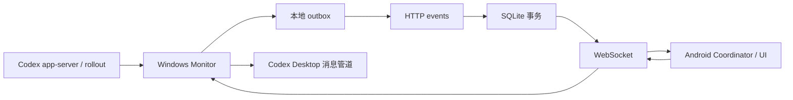

# 架构与实现合同

## 端到端链路

保留最小闭环：官方读取 → 脱敏快照 → 持久化 outbox → HTTP 幂等入库 → WebSocket 增量/快照 → 客户端状态与界面。消息与按需详情通过独立控制通道，不能用上传队列自动重放写操作。

当前是单工作站共享 Token 产品，服务端拒绝第二个在线控制器。数据库的设备维度用于幂等；客户端以 task.id 展示，不承担多个工作站同名任务的合并。没有多用户、跨租户、独立 Web 后台、iOS 或 macOS 客户端。

## 分层和所有权

|模块|拥有的数据及职责|
|---|---|
|protocol|严格 v3 对象、状态枚举、长度限制与安全 span 投影|
|desktop/app-server|stdio JSON-RPC 的启动、请求期限和只读详情；Goal RPC 失败必须传播，显式 null 才表示无 Goal|
|desktop/lifecycle|仅从 thread/list 明确提供的 rollout 路径增量读生命周期，不遍历 Codex 数据库|
|desktop/monitor|非重入轮询、线程缓存、投影、outbox、交互所有权、控制通道|
|desktop/codex-host|本机 Desktop 管道发现、帧解析、消息接受；不自动重发写入|
|desktop/main / preload / renderer|安全 IPC、进程/窗口/托盘生命周期；窄桥接；本地呈现|
|server/app|HTTP 组合、鉴权、严格验证、健康和关闭生命周期|
|server/stream|独占连接集合、订阅、工作站身份、控制请求与交互表|
|server/database|预编译语句、事务、幂等事件、快照与诊断保留|
|server/tracing|实例级 OTel provider，显式父上下文，批处理 SQLite exporter|
|Android SyncCoordinator|应用进程唯一同步入口、Activity/服务所有权和网络回调|
|Android TaskRepository|串行 WebSocket 状态机、代次校验、重试与有界回执|
|Android ViewModel / Compose|可见详情分页、草稿、消息回执与导航；不另建连接|

复用 Fastify、ws、Node SQLite、OpenTelemetry、OkHttp、Compose 和 markdown-it；不增加通用业务配置层或预测性抽象。

## 采集与状态

轮询间隔 2 秒，一轮未结束不会重入。线程元数据、计划修订、Turn 通知变化才重新读取四类详情；最多并行处理 8 个线程，每线程可并行 4 个 RPC，因此详情 RPC 理论峰值 **32**，单请求 15 秒期限。缓存保存基础证据，每轮重新投影；文件读取失败不能永久保留过期 running。

rollout 冷启动从尾部读取，此后增量读取；每线程每轮预算 2 MiB，未完成行上限 1 MiB。替换、缩短、路径变化会重建读取位置。路径、原始行、命令输出不离开采集器。

独立 app-server 的 notLoaded 不等于空闲。历史 task_started 只提供有限运行证据：普通回合静默 30 分钟、仍有 inProgress 操作的回合静默 6 小时后进入 needs_action/stale，并附 ACTIVE_EVIDENCE_EXPIRED；不能伪造完成。官方明确运行/等待状态与 Goal 优先级见[协议](protocol.zh-CN.md)。

## 持久化与性能

每轮变化先合并持久化 outbox，再上传；未成功落盘不得发送。outbox 上限 5000，满队列先尝试排空。每轮最多上传 100 个事件、约 1 秒预算，单请求 10 秒，失败退避最大 60 秒。期限以每次请求之间检查，慢请求仍可能超过该预算。确认响应须符合协议；已确认事件按批保存。崩溃导致的重复上传由 `(deviceId, localSequence)` 幂等处理。损坏队列保留现场并停止，不重置序号。

SQLite 事件和当前快照在同一事务提交；复用固定 prepared statements，同一快照仅序列化一次。提交后广播和确认不等待诊断 exporter。Trace 有界异步写入、客户端队列和日志轮转见[追踪设计](trace.zh-CN.md)。业务事件不自动删除，容量管理见运维。

服务端 auth/subscribe 总期限 15 秒，未认证连接也由实例持有并在关闭时释放。控制请求最多 256、期限 30 秒，用一只定时器管理。实时发送缓冲 256 KiB 触发断开恢复；最多回放 500 条，随后完整快照校准。快照不是分块协议，其内存随任务数增长。

## 客户端稳定性

Windows 保存配置先验证并原子写入，再停止旧 Monitor；回调携带代次，旧实例不覆盖新状态。本地保存成功与网络连接成功分别反馈。退出先停止新工作、等待已有请求收尾并保存队列。

桌面相同任务快照不替换整个 DOM，周期状态仅更新状态栏，保留焦点与输入法。变化时保留受支持输入的选择区和滚动位置。Markdown 用 html:false 的 markdown-it，代码和表格可滚动，禁止原始 HTML 与危险链接。页面不能导航至其他来源，IPC 同时校验发送窗口和精确 file URL。

Android 可见 Activity 与前台服务共享连接；只在当前连接 snapshot 后显示已连接。StateFlow 可合并状态，所以回执按 requestId 累积，最多 1000 条；详情传输层保留最近 20 个单页回执，可见详情持有完整分页，关闭释放该分页。草稿/分区以任务为键保留在页面可保存状态，消息回执仅清除未被编辑的对应草稿。进程重启不承诺所有草稿恢复。

通知的去重键包括连接说明和任务状态；十秒节流限制声音，不能阻止最新通知文本更新。设置复用 UpdateChecker，避免每次点击创建 HTTP 连接池。

## 能力边界

Desktop 自己拥有的审批不能由独立 app-server 代答；只透传采集器实际收到的交互。普通消息使用非公开 Desktop 管道，必须在目标 Desktop 版本验证。网络断开和超时表示结果未确认，不表示任务失败；从不自动重发普通消息。

设计中的资源上限不等于全端性能保证。验证与未覆盖项分别记录在[验收](acceptance.zh-CN.md)；后台系统限制、真实设备声音、读屏及生产负载不能由本机单元测试替代。
