# CodexAssistant 前端设计实施规格 · Final 1.0

面向 Windows Codex 工作站与 Android 手机/平板的任务进度查看、回合摘要与消息交互工具。

> 文档冻结日期：2026-09-09。本文是目标设计合同，不代表当前代码已实现全部目标行为。设计图为可编辑 SVG 结构稿，不是产品运行截图，也不是 ImageGen 输出。

### 2026-09-10 修订（导航、消息与状态统一）

1. Android 一级导航仅显示在任务首页与设置首页。任务详情、连接与诊断、外观、通知、关于与更新及连接编辑均不显示底部导航/Navigation Rail。键盘打开时一级导航隐藏。返回顺序为键盘 → 弹层 → 当前页面父页；设置子页 → 设置首页 → 任务首页。连接编辑取消/返回恢复编辑前的页面，未保存变更仍须确认。
2. Windows 本机发送链路为 renderer → IPC task.send → Monitor → Codex Desktop 宿主，不绕经云端。使用 workstation.status.ready（initialize 回执及 initialized 通知后为 true，进程退出/停止为 false）判断本机就绪。sync.status 的 connecting/syncing/connected/offline 只表示采集同步，不作为本机发送的禁用条件；采集/上传中仍可发送。未就绪显示“本机 Codex 服务尚未就绪。草稿已保留，就绪后请手动发送。”，就绪后不自动提交。
3. Windows 托盘与窗口图标读取随安装包分发的 tray.ico，包含 16/20/24/32/48/256px 图层。不得使用 SVG data URL；构建校验 ICO 头，运行时检查 nativeImage 非空。关闭窗口保留托盘，双击恢复，右键退出。
4. Windows 和 Android 使用同一筛选顺序及中文标签：全部、running 进行中、completed 已完成、failed 失败、needs_action 待确认。连接、freshness 和回合状态不属于任务状态。

2026-09-10 开发前验收：Codex 交互请求透传与四状态模型已在主文档定义，开发前须完成人工确认。

[图文阅读版与界面索引](frontend-design/index.html) · [结构化界面规格](frontend-design/spec.json) · [审查与验收记录](frontend-design/review.md)

## 1. 权威顺序与实施范围

Android 网络恢复已实现并通过模拟器验收，发布候选为 Android 2.0.12（versionCode 15）。详细生命周期、超时与恢复合同见 [Android 网络恢复设计](android-network-recovery.zh-CN.md)。

Windows是原生框架的Electron托盘应用；Android为Compose应用；无独立Web后台、macOS或iOS客户端。桌面默认窗口1100×760，最小430×600；430–839宽使用单栏，保留小窗口监控用途。关闭窗口保留托盘；只有托盘“退出”停止采集。

同一交付中：交互表和字段规则 > 几何规范 > SVG 示例值。示例值是合成测试数据，不是默认业务数据。业务状态只取服务端或本地桥接回执；画面不允许推断业务成功。若未来协议改变，必须升级本文件与 spec.json；不得让开发者自行猜测一个静默替代行为。

## 2. 现状证据与设计差额

本轮统一四种任务状态、消息直达和动态交互表单。服务端在 started 或 failed 回执后结束发送路由；交互以 requestId+threadId 校验并保证终态幂等。官方用户输入保留所有问题一次提交，MCP 枚举表单支持多选。独立 app-server 无法替其他进程应答请求，此限制明确保留。

## 3. 视觉、布局与组件规范

所有数字为目标值；Windows/Web 使用 CSS px，Android 使用 dp，字体使用 sp。SVG 画布代表逻辑视口，不含外部显示器边框。默认缩放 100%。

|尺寸/组件|规范|
|---|---|
|Web/Windows 基准|1440×900；桌面壳宽≥1200 时导航240、左右正文边距32、工作区余宽；正文内居中最大1120；聊天正文最大800|
|中等宽度|840–1199：导航80；正文左右24；右侧检查器一律覆盖，不压缩聊天|
|紧凑宽度|320–839：单栏；导航折叠为覆盖层，内容边距16；手机基准390×844|
|Android 断点|<600 单栏、600–839 单内容、≥840 为320宽列表+剩余详情；仅一级页面额外显示80宽 Navigation Rail，二级页不保留 Rail；只有≥840才双栏，防止600dp塞入三列|
|系统栏|Android 图示状态栏24/手势16仅为基准；实际读取系统 Insets；Windows 原生标题栏由系统控制，图示32仅标位置；不得自绘红黄绿圆点|
|导航与顶栏|应用顶栏64；手机底部导航56+系统底栏Inset；图中表单内容可独立纵向滚动；未显示字段在同一滚动容器中|
|正文层级|页标题24/32、分区20/28、正文16/24、控件14/20、辅助12/18；字体Segoe UI/微软雅黑，Android系统字体；字号不小于12|
|间距|4、8、12、16、24、32、48；表单字段组间10，分区间24；屏幕图按字段类型使用78或126高的组；字段label到输入顶26|
|控件|输入框48高；多行输入最小96/最大240后内部滚动；按钮44高，Android点击区域扩为48；按钮左右16；图标20；焦点2px描边+2px间隔|
|外观|卡片圆角12、输入与按钮8、手机Sheet顶部20；边框1；图标取本项目现有线性图标体系，线宽1.75；禁止Emoji代替常规导航图标|
|弹层|桌面对话框宽480，复杂审批640；最大高度视口-64，内容滚动、操作栏固定；手机为全宽Sheet或全屏详情，最大高度可用视口-24|
|层叠|正文0、悬浮工具10、遮罩40、Sheet/Dialog50、Toast60；同一时间最多一个模态层，子详情在层内切换，不堆叠弹窗|
|操作优先级|交互表第一项为主操作，第二项为次操作；其余放右上“更多操作”菜单；菜单顺序与表一致；危险项置底并用危险文字色|
|长内容|列表标题2行省略，详情允许换行；逻辑路径/标识可中部省略，详情可复制全值；代码、表格内部横滚，不使页面横滚；所有图都是首屏示例|
|动效|按钮反馈即时；展开160ms ease-out、Sheet200ms、Toast4秒；减少动态效果开启时动画0ms；骨架不闪烁、不模拟百分比|

深色主题明确映射：bg=#111820，surface=#1B2632，text=#F1F5F9，muted=#BCC8D5，border=#65768A，selected=#293E54；主色文字在深色下用#A8D0FF，Android深色按钮背景#9AC3FF、文字#102A4C；Windows背景#2457A6、文字#FFFFFF；#A8D0FF仅用于深色主题链接和文字，不作为白字按钮底色。Android固定使用本项目品牌色；本版不提供动态色开关。按钮hover叠加5%黑色，pressed叠加10%黑色（sRGB通道分别乘0.95/0.90并四舍五入），键盘focus使用2px #A8D0FF外圈，disabled使用surface背景和muted文字，并由真实disabled属性阻止提交。危险按钮浅色#B42318/白字，成功#067647，警告#8A4B08。

Android导航仅在一级页存在：600dp及以上的rail也适用；进入任务详情保留平板业务列表/详情双栏，但移除一级rail。二级页面宽度不再预留导航空间。

|Token|浅色值|用途|
|---|---|---|
|bg|`#F3F6FB`|bg|
|surface|`#FFFFFF`|surface|
|text|`#17212B`|text|
|muted|`#52616E`|muted|
|border|`#7B8A98`|border|
|primary|`#2457A6`|primary|
|selected|`#E6F0FF`|selected|

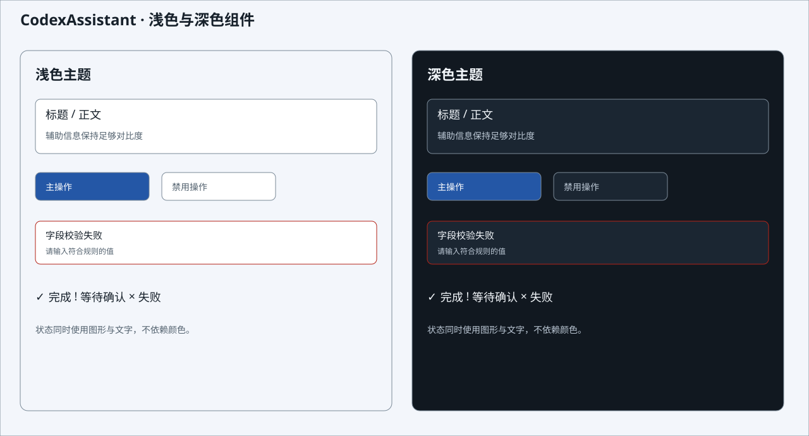

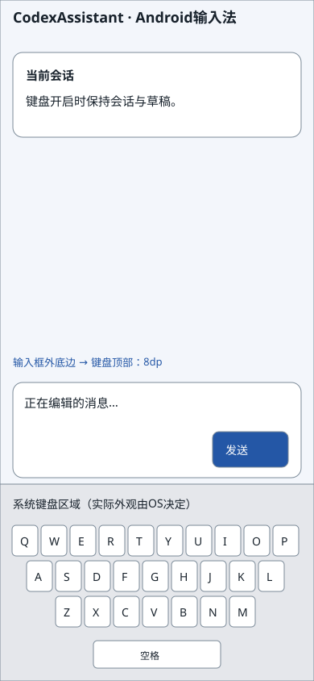

### 统一交互规则（适用于下文每个界面和动作）

G01：进入页面先读缓存（若存在且属于当前账号），标记“上次同步”；同时发起只读刷新。首次无缓存显示骨架；成功空数组才显示“暂无…”。失败不删除已有数据。未知数值显示“未提供”，绝不能显示0冒充测量值。

G02：普通消息立即提交且允许连续发送；交互表单提交时禁用该请求的重复操作，按钮文字“处理中…”，输入保持；远端业务写入只在服务端明确成功后显示成功并清空对应草稿；纯本地动作与系统桥接按G13的本地完成条件判断。失去连接或超时显示“结果尚未确认”，先查询资源状态再允许重发；非幂等操作不得静默自动重试。只读请求可手动重试。

G03：关闭表单/切换账户前如有未保存修改，弹“放弃未保存内容？”；默认焦点“继续编辑”，另有“放弃并离开”。普通页返回不弹确认。关闭模态层先返回其父层，焦点恢复到触发控件；正在提交时可离开但不假称操作被取消，后台结果按资源ID归并。跨账号迟到响应一律丢弃。

G04：表单字段规范是UI约束，不能放宽协议上限。消息长度按UTF-16代码单元校验；仅在提交时去除首尾空白，正文保留换行与内部空白。字段失焦校验；提交先定位第一处错误；服务端422/400映射到字段，未能映射的显示表单顶部。未在字段表中列出的字段不允许由设计实现者自行新增。

G05：Web/Windows Enter发送、Shift+Enter换行，输入法正在组合（isComposing）时Enter只确认候选；Android多行IME默认换行，使用显式发送按钮。空白正文禁发。离线保留当前进程草稿但禁发；恢复连接后不自动发送。消息发送与文件上传分开反馈。

G06：用户距底部≤80px时新增消息跟随；向上滚动超过80px暂停跟随，显示“查看新消息”；加载历史保留首个可见消息ID与偏移。打开/关闭检查器不重置会话。草稿按账号+服务地址+会话ID隔离，只存内存；跨进程不承诺恢复。重命名/主题/导航展开状态允许本机偏好保存，不保存Token或正文到普通偏好存储。

G07：401先结束当前订阅，显示重新登录；403解释权限不足且不可通过按钮重试升级权限；404显示资源已不存在并返回列表；409重新获取最新状态并展示差异；429依据Retry-After倒计时；5xx允许手动重试读取。错误Toast不替代持久错误区。认证失败不循环重连。普通发送由宿主调用10秒期限控制；Android在120秒仍未获回执时提示“结果尚未确认”，不能当作回合失败。详情读取期限30秒。

G08：时间以协议值存储（ISO UTC或epoch毫秒依本项目），显示到本地时区；列表用相对时间，详情显示YYYY-MM-DD HH:mm:ss UTC±hh:mm。日期边界采用用户选择时区，不固定+8。所有示例名/时间/文件为合成数据。

G09：所有控件用原生按钮/输入语义；Tab按视觉顺序、Esc关闭最上层弹窗；焦点圈全程可见；读屏按标题、状态、正文、操作顺序；错误用role=alert，流式按段以polite播报。触控最小48dp，不依赖hover/滑动唯一操作。字体200%时允许重排，禁止裁掉按钮文字。

G10：手机IME与系统底栏不叠加：内容底部留白=max(IME.bottom,systemBars.bottom)，只有最外层消费系统Inset；键盘打开隐藏底部导航，输入框外底边距键盘顶部8dp，容差±2dp。Web嵌入容器使用可用动态视口高度，父壳与子页面不得同时增加bottom padding。系统返回优先收键盘、再收Sheet、再退页面。

G11：界面图绑定的事件ID是验收ID。每条动作至少执行正常完成、不可执行/失败、双击和返回四类测试；local/system使用本地或系统完成条件，read/write使用远端回执；图片里的成功/失败是从处理中分支，绝不能按图横向顺序理解为成功后自动失败。任何与UI无关的trace/requestId只在“诊断详情”折叠区提供，不挤占普通工作流。

G12：同组菜单项约定：启用只发送enabled=true、停用只发送false；启动只调start、停止只调stop、暂停只调pause、恢复只调resume；取消只调cancel、继续只调resume；保存已有对象调用update、新建调用create；刷新只读取或refresh，安装只调install；查/下载/打开是不同阶段，只在前一阶段成功后显示下一动作。交互表用“/”列出的互斥动作按这里绑定，不能一次点击同时调用所有API。

### 固定导航映射

|导航项|目标页面|
|---|---|
|任务|CA-03|
|连接状态|CA-12|
|通知|CA-10（仅Android；Windows隐藏此导航项）|
|外观|CA-09|
|关于|CA-11|

同一导航项有多个页面时，进入表中第一个页面，页内标签按表列顺序出现；切换标签不重新认证。登录前这些业务导航全部隐藏；非法角色直接访问目标页返回无权限。Web路由采用应用内状态，不要求增加未实现的服务端URL。Android通知携带的资源ID仅用于本客户端查找，不拼接外部执行URL。

### 动作类别、网络例外与确认层（G13–G16）

G13：每个动作标记执行类别。纯本地动作以本地状态更新为完成条件，不等待网络、不得显示请求失败或“结果尚未确认”。复制与系统调用以对应Promise/系统回调为准；只表示文本已写剪贴板、选择器已返回或页面已打开，不代表业务成功。退出账户先清本地凭据与订阅，网络失败不能阻止退出。远端读取失败保留缓存，重试同一查询；远端写入才适用G02的未知结果核实规则。动作前置条件的明确离线许可优先于通用在线规则。

G14：返回/取消表单时没有修改则直接关闭；有修改显示“放弃未保存内容？”，正文“离开后，本次未保存的修改将丢失。”；左“继续编辑”、右“放弃并离开”，默认焦点左，Esc/点击遮罩等同继续编辑。确认放弃只丢弃当前表单草稿。正在执行的远端写入不被返回键取消；其结果只更新原资源，不把用户强行带回原页。

G15：名称含“删除”的动作必须确认：标题“删除{对象类型}？”，正文展示当前对象完整名称及该动作成功规则中的删除范围；左“取消”、右“确认删除”，默认焦点取消，危险按钮#B42318。确认前不发请求；取消不改变数据。拒绝审批/候选仅改变对应决策状态，不套用物理文件删除文案。对于本机文件删除，以归档审批页给定路径及权限为准，不能从列表直接删原件。

G16：控件可见性按角色、平台、当前状态和动作前置条件共同决定。平台不存在的能力隐藏；当前状态不可用的操作保留并禁用，旁边展示具体原因。菜单按交互表顺序排布，删除项置底；桌面菜单宽280、每项44高，Android宽min(视口-32,360)、每项48高，长标签换行扩高。菜单锚定右上“更多操作”，超出底部时向上展开，最大高为可用视口-48并内部滚动。打开聚焦首个可用项；上下箭头移动、Enter执行、Esc关闭并还原焦点。点击遮罩只关闭菜单，不提交。

### 逐页导航高亮与回退归属

|页面ID|Windows/Web导航归属|Android导航归属|
|---|---|---|
|CA-01|隐藏（认证壳）|隐藏（认证壳）|
|CA-02|隐藏（认证壳）|隐藏（认证壳）|
|CA-03|任务|任务|
|CA-04|任务|任务|
|CA-05|任务|任务|
|CA-06|任务|任务|
|CA-07|任务|任务|
|CA-08|任务|任务|
|CA-09|外观|设置|
|CA-10|通知|设置|
|CA-11|关于|设置|
|CA-12|连接状态|设置|
|CA-13|任务|任务|

表中归属只用于本页支持的平台；页面注册表未列出的平台不产生该页面。认证页没有业务导航。由另一业务页临时打开的详情保留来源导航高亮；关闭详情恢复原选择。

Android底部“任务”进入CA-03；“设置”进入设置首页，页内提供连接与诊断CA-12（再进入连接编辑CA-02）、外观CA-09、通知CA-10、关于与更新CA-11四个固定入口。这些子页不展示一级导航，返回设置首页。桌面没有通知导航。

Android 设置页：居中最大720dp、外边距24dp；顶部连接卡片，设备偏好分组，辅助说明和≥48dp点击目标。二级页显示返回，主题立即保存，系统状态栏与导航栏同步主题并保证图标对比度；使用 AndroidX edge-to-edge 和安全区避免内容被系统栏遮挡。连接编辑保留丢弃确认。交互秘密只存内存，不进入 saved state、日志和结果回显。

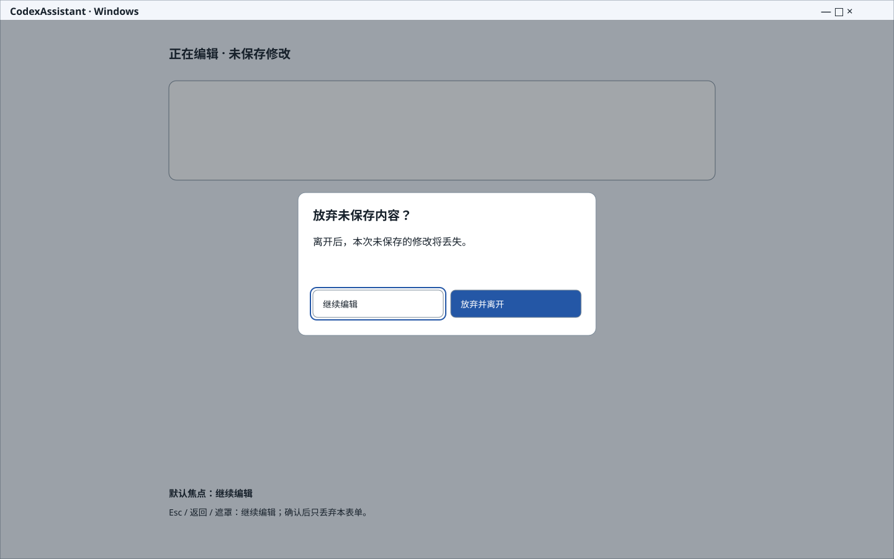

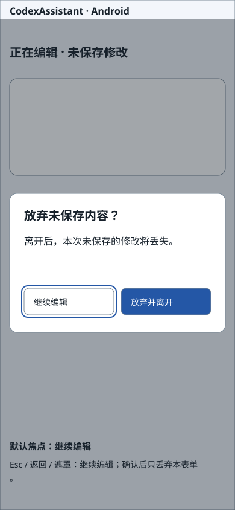

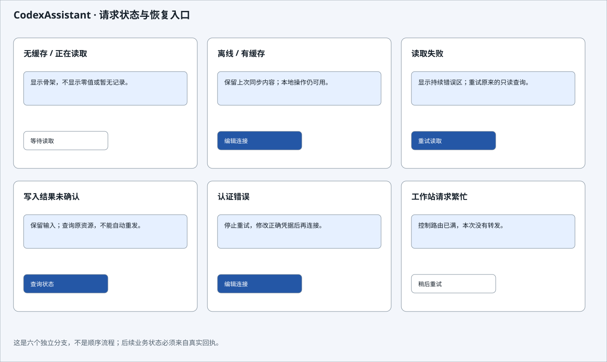

## 4. 状态、数据与权限合同

|域|值与展示|
|---|---|
|TaskSnapshot.status|running进行中；completed已完成；failed失败；needs_action待确认|
|activeFlags|waitingOnApproval显示“请处理待确认请求”；waitingOnUserInput显示“等待补充信息”并可发送文本；交互请求通过统一表单处理|
|latestTurn.status|inProgress进行中；completed回合完成；interrupted回合中断；failed回合失败；中断不等同TaskSnapshot新增一个cancelled值|
|freshness|fresh近期采集、stale缓存、unavailable无法采集；完全按字段显示，不根据updatedAt超过10秒推断过期|
|连接|Windows connecting/syncing/connected/offline；Android connecting/authenticating/subscribing/connected/reconnecting/offline/auth_failed/protocol_error/not_configured；两端不合并状态机|
|计划|pending待开始、in_progress执行中、completed完成、failed失败；进度=completed数量/plan长度；无计划不显示0/0、百分比或伪步骤|
|按需详情|用户打开详情触发一次detail，limit=20；cursor只从上一页返回值读取；有cursor才显示“加载更早回合”，每次点击加载一页；关闭后丢弃回合正文缓存，不在云端保存整个历史|
|消息|send.text去首尾空白后1–20000字符；requestId为新UUID；started只表示Desktop已接受并结束本次发送；failed表示未获得成功确认，保留草稿，不自动重发；每次明确发送产生新requestId，旧回执不清除新草稿|
|非结构化回合|turns为unknown[]，只提取id/status/startedAt/completedAt和type为用户消息/助手消息的可读text；其他对象显示“此内容请在工作站查看”，不得直接JSON.stringify展示|
|身份|服务使用共享Token而不是多用户隔离；界面不伪造不同用户或设备角色；Android详情/发送由云端转发至已连接桌面控制器，不可达时说明“工作站未连接”；Windows通过本机IPC并按本机ready提示，任务快照仍可查看|
|Windows本机控制|workstation.status.ready 独立于 sync.status；ready=true且正文有效、正文有效即可发送；Android仍须已完成云端订阅，工作站不可达由服务端回执提示|
|动态交互|interaction.request 包含 questions 的 id/header/question/required/multiple/isOther/isSecret/options；一次提交全部 answers。确认使用 offered decision ID；取消为 cancel=true；unsupported 不伪造答案。终态由工作站回执或官方解决事件确定。详见 protocol.zh-CN.md。|

## 5. 页面注册表

|ID|界面|设备|来源|
|---|---|---|---|
|[CA-01](#ca-01)|首次连接|Windows, Android|`apps/desktop/src/desktop-config.ts`|
|[CA-02](#ca-02)|连接编辑与恢复|Windows, Android|`apps/desktop/src/renderer/workspace.js`|
|[CA-03](#ca-03)|任务首页与筛选|Windows, Android|`apps/desktop/src/renderer/workspace.js`|
|[CA-04](#ca-04)|任务详情与执行计划|Windows, Android|`apps/desktop/src/renderer/workspace.js`|
|[CA-05](#ca-05)|回合摘要与分页|Windows, Android|`apps/desktop/src/monitor.ts`|
|[CA-06](#ca-06)|向工作站发送消息|Windows, Android|`apps/desktop/src/renderer/workspace.js`|
|[CA-07](#ca-07)|回复流与未确认送达|Windows, Android|`apps/server/src/app.ts`|
|[CA-08](#ca-08)|Windows托盘与窗口|Windows|`apps/desktop/src/main.ts`|
|[CA-09](#ca-09)|设置与外观|Windows, Android|`android/app/src/main/java/site/codexassistant/SettingsPage.kt`|
|[CA-10](#ca-10)|Android通知与权限|Android|`android/app/src/main/java/site/codexassistant/CodexScreen.kt`|
|[CA-11](#ca-11)|版本检查与下载|Windows, Android|`apps/desktop/src/main.ts`|
|[CA-12](#ca-12)|连接诊断与只读状态|Windows, Android|`apps/desktop/src/renderer/workspace.js`|
|[CA-13](#ca-13)|平板列表与详情|Tablet|`android/app/src/main/java/site/codexassistant/CodexScreen.kt`|

## CA-01 · 首次连接

**入口与返回**：首次启动无有效凭据进入；成功进入CA-03。

**角色/设备**：未配置/重新配置；Windows, Android。

**导航归属**：认证页不展示业务导航 Android二级页不展示一级导航；按来源返回任务列表或设置首页。

**布局**：未认证壳：无业务侧栏、无底部导航；桌面居中480宽表单，手机左右16；应用名称、表单标题、字段、操作顺序展示。本项目没有注册或令牌发行页。

**数据绑定**：`apps/desktop/src/desktop-config.ts`。Windows connection.save；Android CredentialStore/SyncCoordinator。

|控件（从上到下）|类型|图中示例|校验/显示合同|
|---|---|---|---|
|服务地址|input|https://monitor.example.test|必填HTTPS根地址；只允许回环HTTP；拒绝用户信息/query/fragment/API子路径；去末尾斜杠|
|访问Token|password|••••••••••••••••|必填16–4096字符；密码遮挡；只在凭据安全存储中保存|

**页面规则**：不增加虚构的health+auth测试接口。用户可以离线保存合法配置；保存成功后进入CA-03；网络失败在CA-03显示连接错误并可编辑。已有Token不回填renderer。

**空态/加载/错误**：初次进入立即显示本页表单；只有读取本机配置期间显示“正在读取配置…”，不显示“暂无记录”或列表空态。服务失败在表单顶部持续显示，字段错误在对应字段下显示，保留输入并聚焦首个错误。认证请求需要在线；本机配置保存按该动作前置条件执行。

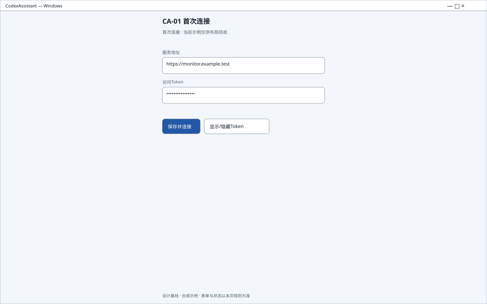

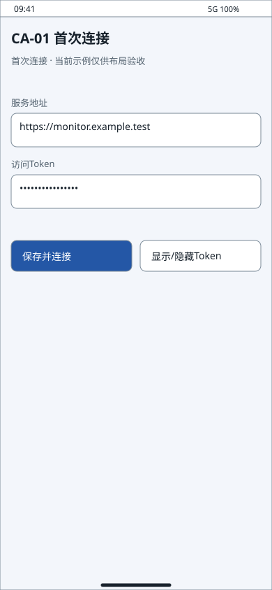

### 交互合同与状态图

**CA-01.I01 — 保存并连接**

|条目|精确定义|
|---|---|
|触发与前置|服务地址和凭据满足字段规则；允许离线保存到本机安全存储，同一时刻只有一条配置保存。|
|执行类别|system（按G13解释）|
|事件/调用|`connection.save / Android配置保存`|
|处理中|等待本机安全存储回调；只禁用当前保存按钮，不把网络握手作为本机保存成功的条件。|
|成功|保存成功后进入CA-03；连接横幅仍显示真实握手状态，收到snapshot才显示同步完成。|
|失败/重试|安全存储失败则留在表单并显示原因，旧配置保持有效；保存成功但网络握手失败则保留新配置，进入任务页显示连接错误和“编辑连接”入口。|
|返回/取消|返回触发页面，恢复原焦点/滚动；未保存输入按G03确认；在途操作不被伪装取消。|
|验收|Given 操作前示例数据；When 触发“保存并连接”；Then 只有真实回执后呈现上述结果。另模拟失败、双击、离开页面，核对G02/G03。|

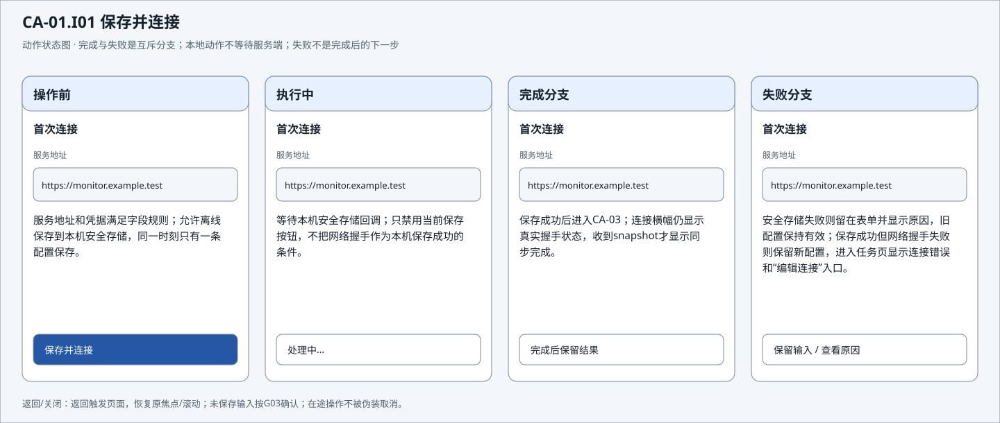

**CA-01.I02 — 显示/隐藏Token**

|条目|精确定义|
|---|---|
|触发与前置|用户点击眼睛按钮；输入有值；无网络前提。|
|执行类别|local（按G13解释）|
|事件/调用|`local.revealToken`|
|处理中|本地即时切换，无请求。|
|成功|仅当前输入在内存中切换可见；离页恢复遮挡。|
|失败/重试|不产生网络错误；目标对象在本地已移除则提示“内容已不可用”并保留当前页面。前置条件不满足时禁用并说明原因。|
|返回/取消|返回触发页面，恢复原焦点/滚动；未保存输入按G03确认；在途操作不被伪装取消。|
|验收|Given 本页前置条件满足；When 点击“显示/隐藏Token”；Then 本地状态立即符合成功规则。断网重复执行仍可用；返回恢复焦点，不产生远端写请求。切换类连续点击按当前值逐次切换。|

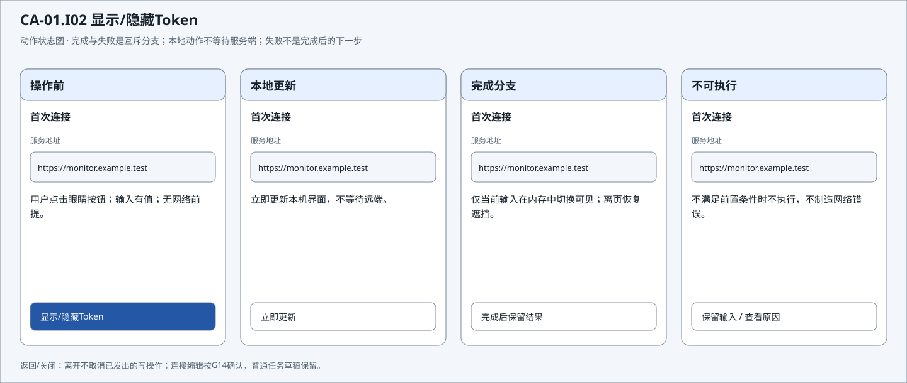

### 页面验收

本页每个字段、每个动作和全部失败分支都有对应UI；320宽和200%字号可滚动到所有控件。不得用空值模拟成功。绑定见本页来源文件；实现检查本页所有事件ID。

## CA-02 · 连接编辑与恢复

**入口与返回**：设置→连接；取消返回原页面。

**角色/设备**：已登录用户；Windows, Android。

**导航归属**：认证页不展示业务导航 Android二级页不展示一级导航；按来源返回任务列表或设置首页。

**布局**：未认证壳：无业务侧栏、无底部导航；桌面居中480宽表单，手机左右16；应用名称、表单标题、字段、操作顺序展示。本项目不提供注册或令牌发行功能。

**数据绑定**：`apps/desktop/src/renderer/workspace.js`。getConnection只返回配置标识/地址；替换Token必须重新输入。

|控件（从上到下）|类型|图中示例|校验/显示合同|
|---|---|---|---|
|当前地址|input|https://monitor.example.test|显示已保存根地址，可编辑|
|新的Token|password|••••••••••••••••|替换必填；绝不把旧密文占位当真实Token 保存要求完整新值；空值不会表示保留原Token。|

**页面规则**：保存失败不将本次字段当已保存值。凭据不可恢复时转CA-01；不提供清空outbox的一键修复。

**空态/加载/错误**：初次进入立即显示本页表单；只有读取本机配置期间显示“正在读取配置…”，不显示“暂无记录”或列表空态。服务失败在表单顶部持续显示，字段错误在对应字段下显示，保留输入并聚焦首个错误。认证请求需要在线；本机配置保存按该动作前置条件执行。

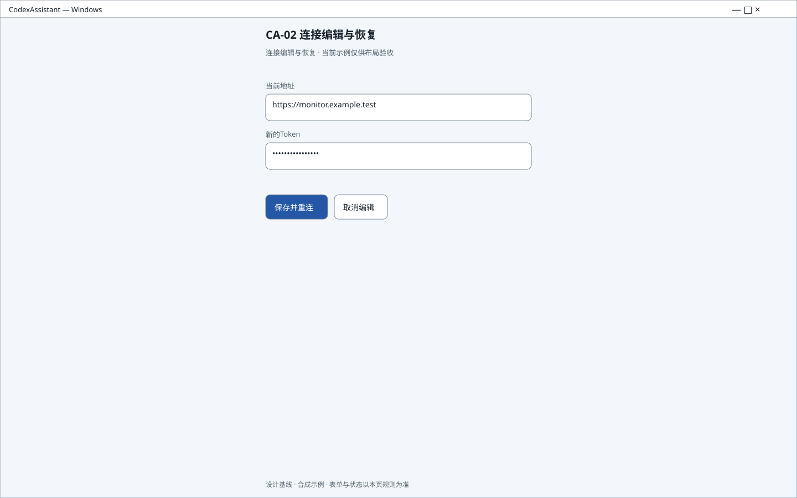

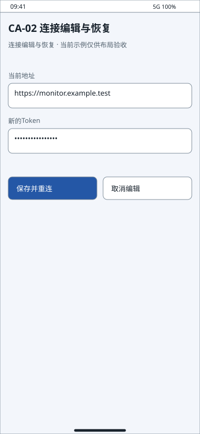

### 交互合同与状态图

**CA-02.I01 — 保存并重连**

|条目|精确定义|
|---|---|
|触发与前置|服务地址和凭据满足字段规则；允许离线保存到本机安全存储，同一时刻只有一条配置保存。|
|执行类别|system（按G13解释）|
|事件/调用|`connection.save`|
|处理中|等待本机安全存储回调；只禁用当前保存按钮，不把网络握手作为本机保存成功的条件。|
|成功|安全存储成功后关闭旧连接，清空旧服务快照，返回CA-03并建立唯一新连接；网络尚未握手时显示连接中，失败时显示连接错误。|
|失败/重试|安全存储失败则留在表单并显示原因，旧配置保持有效；保存成功但网络握手失败则保留新配置，进入任务页显示连接错误和“编辑连接”入口。|
|返回/取消|返回触发页面，恢复原焦点/滚动；未保存输入按G03确认；在途操作不被伪装取消。|
|验收|Given 操作前示例数据；When 触发“保存并重连”；Then 只有真实回执后呈现上述结果。另模拟失败、双击、离开页面，核对G02/G03。|

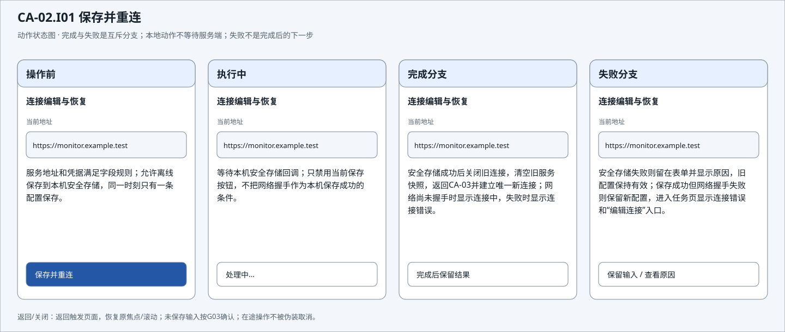

**CA-02.I02 — 取消编辑**

|条目|精确定义|
|---|---|
|触发与前置|用户点击取消；无需联网。|
|执行类别|local（按G13解释）|
|事件/调用|`local.navigateBack`|
|处理中|无请求。|
|成功|不修改已保存凭据；返回设置。|
|失败/重试|不产生网络错误；目标对象在本地已移除则提示“内容已不可用”并保留当前页面。前置条件不满足时禁用并说明原因。|
|返回/取消|返回触发页面，恢复原焦点/滚动；未保存输入按G03确认；在途操作不被伪装取消。|
|验收|Given 本页前置条件满足；When 点击“取消编辑”；Then 本地状态立即符合成功规则。断网重复执行仍可用；返回恢复焦点，不产生远端写请求。切换类连续点击按当前值逐次切换。|

### 页面验收

本页每个字段、每个动作和全部失败分支都有对应UI；320宽和200%字号可滚动到所有控件。不得用空值模拟成功。绑定见本页来源文件；实现检查本页所有事件ID。

## CA-03 · 任务首页与筛选

**入口与返回**：应用启动/底部任务/托盘打开；点击任务进入CA-04。

**角色/设备**：已登录用户；Windows, Android。

**导航归属**：电脑端：任务；Android：任务。返回沿本页规定入口恢复；从系统通知进入时无应用内历史则返回相应导航首页。

**布局**：使用§3设备壳。字段按表从上到下；主体单独滚动，操作区固定在主体底部；主次操作为交互表前两项，其余为右上“更多操作”。

**数据绑定**：`apps/desktop/src/renderer/workspace.js`。tasks.get/onTasks或snapshot/event；过滤仅当前快照。

|控件（从上到下）|类型|图中示例|校验/显示合同|
|---|---|---|---|
|连接状态|record|已连接 · 最近同步 12秒前|连接状态独立于任务状态；显示快照同步时间|
|搜索|input|同步协调器|标题/projectName本地不区分大小写包含搜索；空值显示全部|
|状态筛选|select|全部|全部+四种协议任务状态，不添加离线/已取消到任务枚举|
|任务|record|同步协调器 · 进行中 · 2/5步骤|标题2行；状态文字；有效plan才显示进度|
|最近变化|record|部署检查 · 已完成 · 3分钟前|changedAt降序，等值按id字典序稳定排序|

**页面规则**：不添加批量已读、删除任务或重试任务按钮，因为没有对应业务合同。成功空快照显示“暂无任务”；首次未收快照显示“等待首次同步”。

**空态/加载/错误**：首次读取显示“正在加载任务首页与筛选”；成功无记录显示“暂无任务首页与筛选记录”并保留入口操作。失败就地显示错误区；旧数据标“上次同步”；离线远端写操作禁用；本地查看、返回、复制、外观保存和已明确允许的配置保存仍可用。网络恢复时保留列表和草稿；连接展示真实握手进度，快照前禁发。

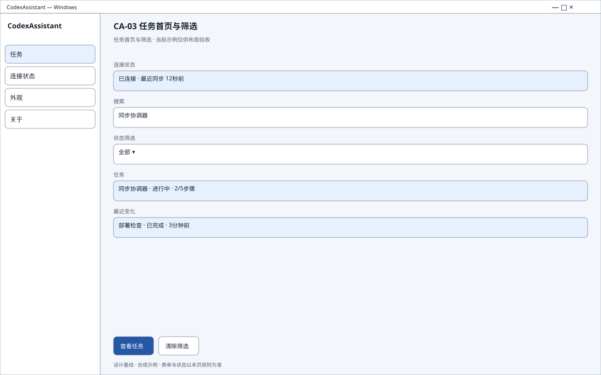

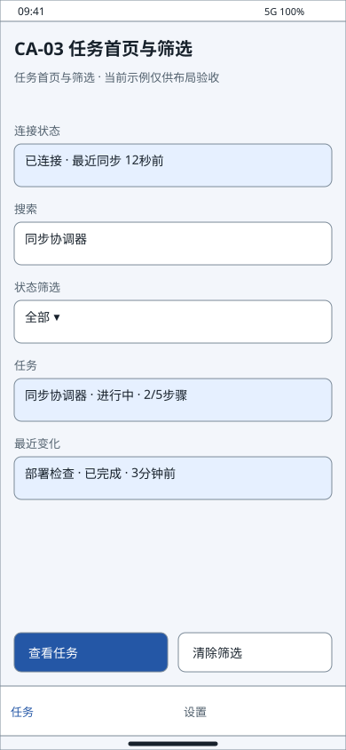

### 交互合同与状态图

**CA-03.I01 — 查看任务**

|条目|精确定义|
|---|---|
|触发与前置|点击已有任务卡，可离线打开已知元数据。|
|执行类别|local（按G13解释）|
|事件/调用|`local.selectTask(taskId)`|
|处理中|本地状态即时更新，无网络请求、无等待服务端回执。|
|成功|选中CA-04并拉取一页回合摘要；点击同项不重复请求。|
|失败/重试|不产生网络错误；目标对象在本地已移除则提示“内容已不可用”并保留当前页面。前置条件不满足时禁用并说明原因。|
|返回/取消|返回触发页面，恢复原焦点/滚动；未保存输入按G03确认；在途操作不被伪装取消。|
|验收|Given 本页前置条件满足；When 点击“查看任务”；Then 本地状态立即符合成功规则。断网重复执行仍可用；返回恢复焦点，不产生远端写请求。切换类连续点击按当前值逐次切换。|

**CA-03.I02 — 清除筛选**

|条目|精确定义|
|---|---|
|触发与前置|有任意筛选；无需联网。|
|执行类别|local（按G13解释）|
|事件/调用|`local.resetFilters`|
|处理中|本地即时更新。|
|成功|搜索置空、筛选恢复全部，保留数据。|
|失败/重试|不产生网络错误；目标对象在本地已移除则提示“内容已不可用”并保留当前页面。前置条件不满足时禁用并说明原因。|
|返回/取消|返回触发页面，恢复原焦点/滚动；未保存输入按G03确认；在途操作不被伪装取消。|
|验收|Given 本页前置条件满足；When 点击“清除筛选”；Then 本地状态立即符合成功规则。断网重复执行仍可用；返回恢复焦点，不产生远端写请求。切换类连续点击按当前值逐次切换。|

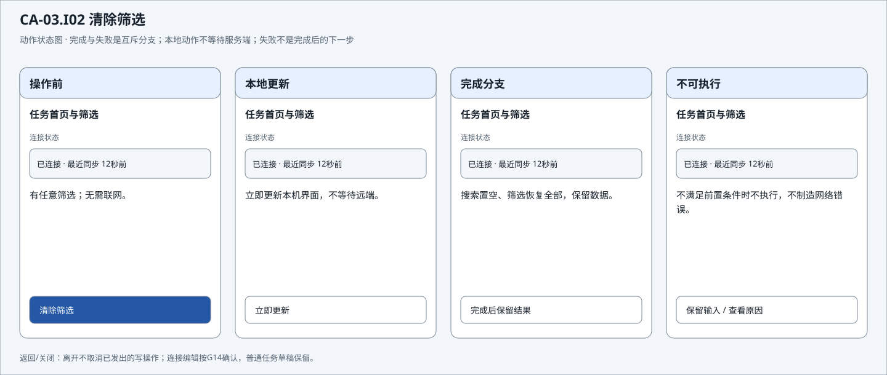

### 页面验收

本页每个字段、每个动作和全部失败分支都有对应UI；320宽和200%字号可滚动到所有控件。不得用空值模拟成功。绑定见本页来源文件；实现检查本页所有事件ID。

## CA-04 · 任务详情与执行计划

**入口与返回**：CA-03选择任务；≥840平板右栏，否则全屏详情；返回列表锚点。

**角色/设备**：已登录用户；Windows, Android。

**导航归属**：电脑端：任务；Android：任务。返回沿本页规定入口恢复；从系统通知进入时无应用内历史则返回相应导航首页。 Android二级页不展示一级导航；按来源返回任务列表或设置首页。

**布局**：使用§3设备壳。字段按表从上到下；主体单独滚动，操作区固定在主体底部；主次操作为交互表前两项，其余为右上“更多操作”。

**数据绑定**：`apps/desktop/src/renderer/workspace.js`。TaskSnapshot + task.detail/threadId。

|控件（从上到下）|类型|图中示例|校验/显示合同|
|---|---|---|---|
|任务|record|同步协调器|完整标题，最多120字符；projectName为可选副标题|
|状态|record|进行中 · 近期采集|同时显示业务状态/freshness，runtimeStatus只在诊断展开|
|步骤|record|正在验证断线恢复 · 2/5|currentStepId匹配plan；若失配显示“当前步骤未提供”|
|执行目标|record|确保设备恢复后继续同步|仅goal存在才显示objective和Token用量|
|最近回合|record|进行中 · 开始于09:30|缺失时显示“暂无回合记录”|

**页面规则**：手机不在列表下方无限追加详情；只保留一个活动详情页。taskId变更时丢弃旧taskId详情响应；迟到回执不得显示到另一任务。

**空态/加载/错误**：首次读取显示“正在加载任务详情与执行计划”；成功无记录显示“暂无任务详情与执行计划记录”并保留入口操作。失败就地显示错误区；旧数据标“上次同步”；离线远端写操作禁用；本地查看、返回、复制、外观保存和已明确允许的配置保存仍可用。

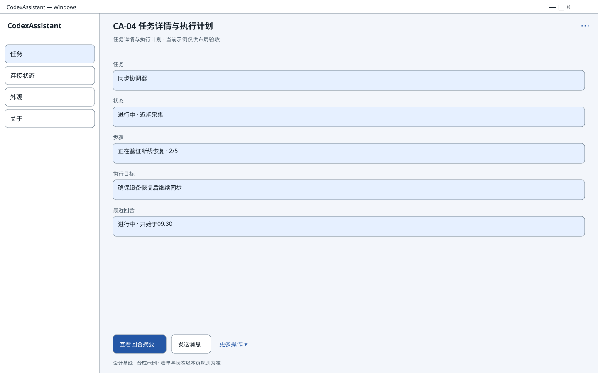

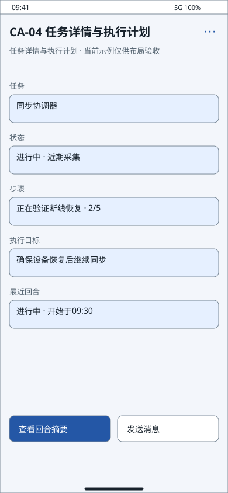

### 交互合同与状态图

**CA-04.I01 — 查看回合摘要**

|条目|精确定义|
|---|---|
|触发与前置|用户点击“查看回合摘要”；字段校验通过、在线、权限允许且此动作无在途请求。|
|执行类别|read（按G13解释）|
|事件/调用|`task.detail / requestDetail(threadId)`|
|处理中|“查看回合摘要”禁用并显示“处理中…”；本页对象保留，禁止并发重复提交。|
|成功|进入CA-05，显示这一页已返回的用户/助手文本。|
|失败/重试|读取失败保留已加载内容并标“上次同步”，首次无缓存显示错误面板；按G07显示对应错误原因，手动重试相同查询，不要求核实写入结果。|
|返回/取消|返回触发页面，恢复原焦点/滚动；未保存输入按G03确认；在途操作不被伪装取消。|
|验收|Given 操作前示例数据；When 触发“查看回合摘要”；Then 只有真实回执后呈现上述结果。另模拟失败、双击、离开页面，核对G02/G03。|

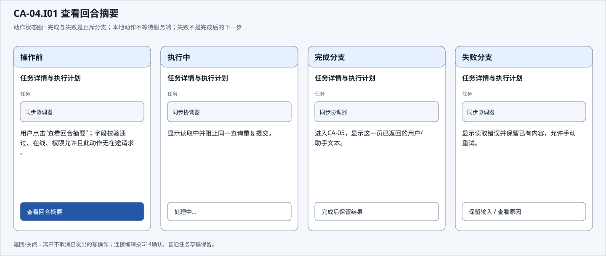

**CA-04.I02 — 发送消息**

|条目|精确定义|
|---|---|
|触发与前置|任务ID存在；允许先离线编辑，离线禁发。|
|执行类别|local（按G13解释）|
|事件/调用|`local.openComposer`|
|处理中|本地打开输入区。|
|成功|进入CA-06并聚焦正文；保留当前taskId。|
|失败/重试|不产生网络错误；目标对象在本地已移除则提示“内容已不可用”并保留当前页面。前置条件不满足时禁用并说明原因。|
|返回/取消|返回触发页面，恢复原焦点/滚动；未保存输入按G03确认；在途操作不被伪装取消。|
|验收|Given 本页前置条件满足；When 点击“发送消息”；Then 本地状态立即符合成功规则。断网重复执行仍可用；返回恢复焦点，不产生远端写请求。切换类连续点击按当前值逐次切换。|

**CA-04.I03 — 查看诊断**

|条目|精确定义|
|---|---|
|触发与前置|任务存在，无网络前提。|
|执行类别|local（按G13解释）|
|事件/调用|`local.openDiagnostics`|
|处理中|本地展开。|
|成功|进入CA-12；不额外拉全量会话。|
|失败/重试|不产生网络错误；目标对象在本地已移除则提示“内容已不可用”并保留当前页面。前置条件不满足时禁用并说明原因。|
|返回/取消|返回触发页面，恢复原焦点/滚动；未保存输入按G03确认；在途操作不被伪装取消。|
|验收|Given 本页前置条件满足；When 点击“查看诊断”；Then 本地状态立即符合成功规则。断网重复执行仍可用；返回恢复焦点，不产生远端写请求。切换类连续点击按当前值逐次切换。|

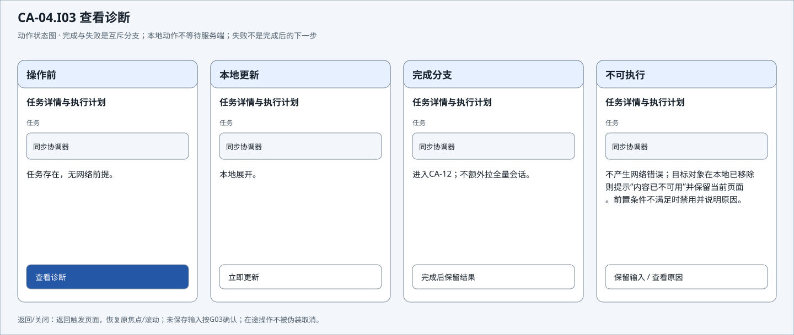

### 页面验收

本页每个字段、每个动作和全部失败分支都有对应UI；320宽和200%字号可滚动到所有控件。不得用空值模拟成功。绑定见本页来源文件；实现检查本页所有事件ID。

## CA-05 · 回合摘要与分页

**入口与返回**：CA-04查看回合摘要；返回CA-04。

**角色/设备**：已登录用户；Windows, Android。

**导航归属**：电脑端：任务；Android：任务。返回沿本页规定入口恢复；从系统通知进入时无应用内历史则返回相应导航首页。 Android二级页不展示一级导航；按来源返回任务列表或设置首页。

**布局**：使用§3设备壳。字段按表从上到下；主体单独滚动，操作区固定在主体底部；主次操作为交互表前两项，其余为右上“更多操作”。

**数据绑定**：`apps/desktop/src/monitor.ts`。readDetail→listTurns(limit20,itemsView=summary)；协议上限50。

|控件（从上到下）|类型|图中示例|校验/显示合同|
|---|---|---|---|
|回合摘要|message|已完成：修复重连逻辑并通过检查。|只渲染可读文本；未知对象不显示原始JSON|
|分页状态|record|已加载20个回合 · 可继续|cursor存在显示加载按钮；初始载入是最新一页|

**页面规则**：不承诺完整工具输出或全量历史；下载/导出全历史不在范围。详情缓存仅当前进程且离页清空，列表同步不得预取所有任务详情。

**空态/加载/错误**：首次读取显示“正在加载回合摘要与分页”；成功无记录显示“暂无回合摘要与分页记录”并保留入口操作。失败就地显示错误区；旧数据标“上次同步”；离线远端写操作禁用；本地查看、返回、复制、外观保存和已明确允许的配置保存仍可用。

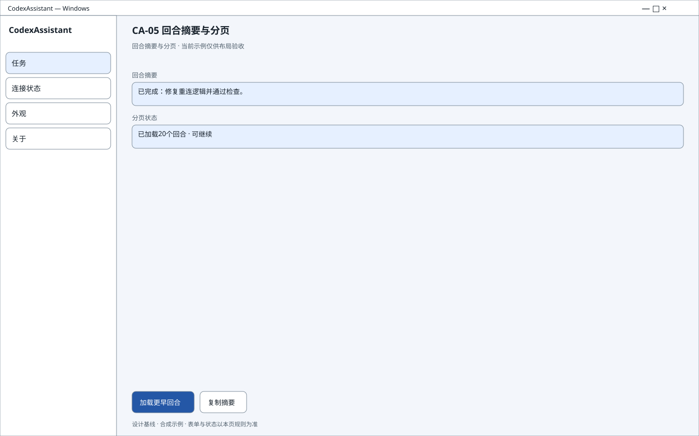

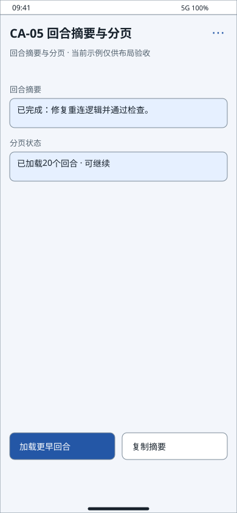

### 交互合同与状态图

**CA-05.I01 — 加载更早回合**

|条目|精确定义|
|---|---|
|触发与前置|在线且上一页返回cursor；同页无在途请求。|
|执行类别|read（按G13解释）|
|事件/调用|`detail(threadId,cursor,limit=20)`|
|处理中|“加载更早回合”禁用并显示“处理中…”；本页对象保留，禁止并发重复提交。|
|成功|在更早一侧插入，保留滚动锚点；按回合id去重；无cursor隐藏按钮。|
|失败/重试|读取失败保留已加载内容并标“上次同步”，首次无缓存显示错误面板；按G07显示对应错误原因，手动重试相同查询，不要求核实写入结果。|
|返回/取消|返回触发页面，恢复原焦点/滚动；未保存输入按G03确认；在途操作不被伪装取消。|
|验收|Given 操作前示例数据；When 触发“加载更早回合”；Then 只有真实回执后呈现上述结果。另模拟失败、双击、离开页面，核对G02/G03。|

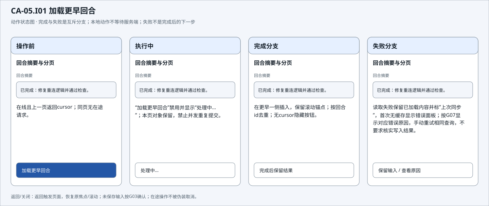

**CA-05.I02 — 复制摘要**

|条目|精确定义|
|---|---|
|触发与前置|可读文本存在；无需联网。|
|执行类别|system（按G13解释）|
|事件/调用|`clipboard.writeText(visibleText)`|
|处理中|等待系统剪贴板写入回调；本动作暂时禁用，不要求联网。|
|成功|仅复制用户选定文本；提示“已复制”。|
|失败/重试|权限拒绝或系统写入失败时显示“复制失败，请手动选择文本复制”；内容不清空，不显示已复制，不自动重试。|
|返回/取消|返回触发页面，恢复原焦点/滚动；未保存输入按G03确认；在途操作不被伪装取消。|
|验收|离线复制成功后显示“已复制”4秒；模拟剪贴板拒绝时保留文本且不显示成功。只有回调成功才能勾记令牌已复制。|

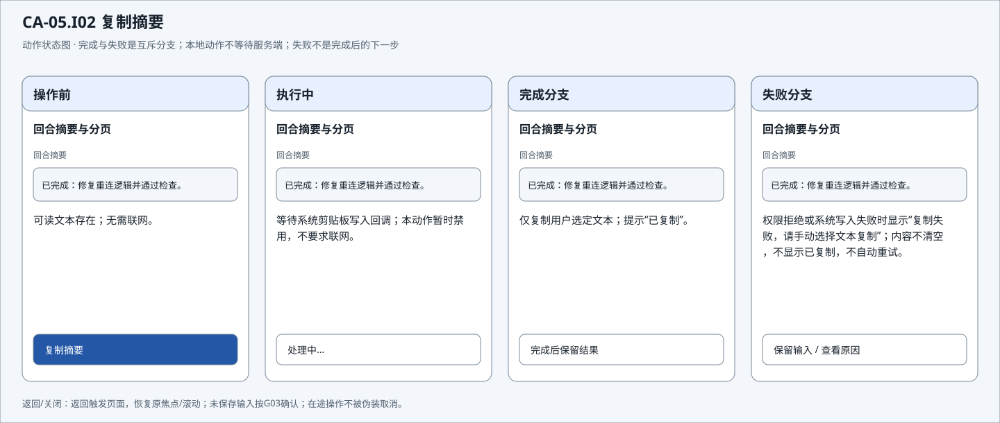

### 页面验收

本页每个字段、每个动作和全部失败分支都有对应UI；320宽和200%字号可滚动到所有控件。不得用空值模拟成功。绑定见本页来源文件；实现检查本页所有事件ID。

## CA-06 · 向工作站发送消息

**入口与返回**：CA-04发送消息；返回仍为该任务详情。

**角色/设备**：已登录用户；Windows, Android。

**导航归属**：电脑端：任务；Android：任务。返回沿本页规定入口恢复；从系统通知进入时无应用内历史则返回相应导航首页。 Android二级页不展示一级导航；按来源返回任务列表或设置首页。

**布局**：聊天模板：顶部会话标题与最多2条上下文信息；用户消息右对齐、助手回答左对齐；消息内容最大800宽，手机铺满减32；正文独立滚动，80高输入面板固定在操作栏上方；其余字段在消息关联详情中展开。空态不生成假历史消息。

**数据绑定**：`apps/desktop/src/renderer/workspace.js`。task.send / ClientSendMessage → Monitor → Codex Desktop send_message_to_thread；独立 app-server 只读。

|控件（从上到下）|类型|图中示例|校验/显示合同|
|---|---|---|---|
|目标任务|record|同步协调器|只读threadId关联的标题，禁止自动切换目标|
|消息内容|textarea|请补充断线恢复的检查结果。|1–20000字符；只去首尾空白；保留正文换行|
|发送状态|record|尚未发送|idle→submitting→accepted/failed；started仅表示消息被Desktop接受，立即结束等待。会话状态单独刷新。|

**页面规则**：发送入口以 docs/desktop-message-routing.zh-CN.md 为准；不自行resume、start、steer。不把同线程的独立app-server通知关联到发送请求；started不是任务完成。Desktop自己持有的审批仍需在Desktop处理。

**空态/加载/错误**：首次读取显示“正在加载向工作站发送消息”；成功无记录显示“暂无向工作站发送消息记录”并保留入口操作。失败就地显示错误区；旧数据标“上次同步”；离线远端写操作禁用；本地查看、返回、复制、外观保存和已明确允许的配置保存仍可用。

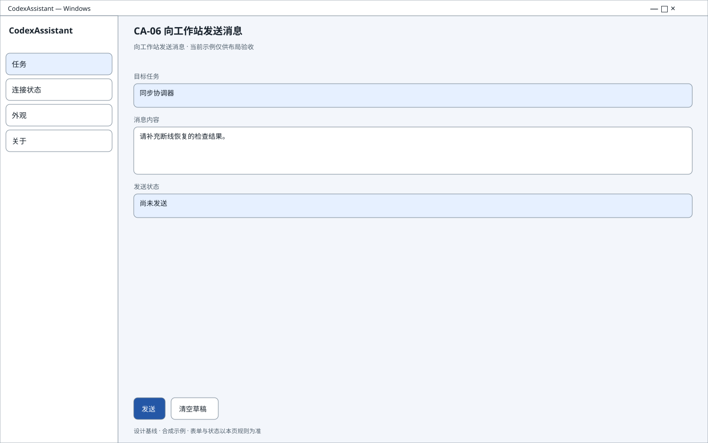

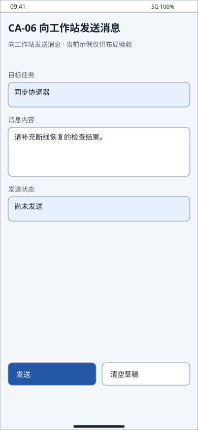

### 交互合同与状态图

**CA-06.I01 — 发送**

|条目|精确定义|
|---|---|
|触发与前置|Windows：workstation.status.ready=true；Android：已完成云端订阅。正文去首尾空白后1–20000字符、运行中仍可继续发送；云端同步中不禁用Windows本机发送。|
|执行类别|write（按G13解释）|
|事件/调用|`task.send / send(threadId,text,requestId)`|
|处理中|“发送”禁用并显示“处理中…”；本页对象保留，禁止并发重复提交。|
|成功|收到started显示“Codex Desktop 已接受消息，可继续发送；进展请查看回合摘要”；清空本次未更改的草稿并恢复发送。|
|失败/重试|无宿主/多个宿主/拒绝显示固定脱敏错误；超时或断线提示结果尚未确认，保留草稿，禁止自动重发。|
|返回/取消|返回触发页面，恢复原焦点/滚动；未保存输入按G03确认；在途操作不被伪装取消。|
|验收|真实Desktop持有活动会话时提交消息并核实原文到达；验证连续发送、失败保留草稿、编辑期间旧回执不清空新草稿；丢失回执仅写入一次。|

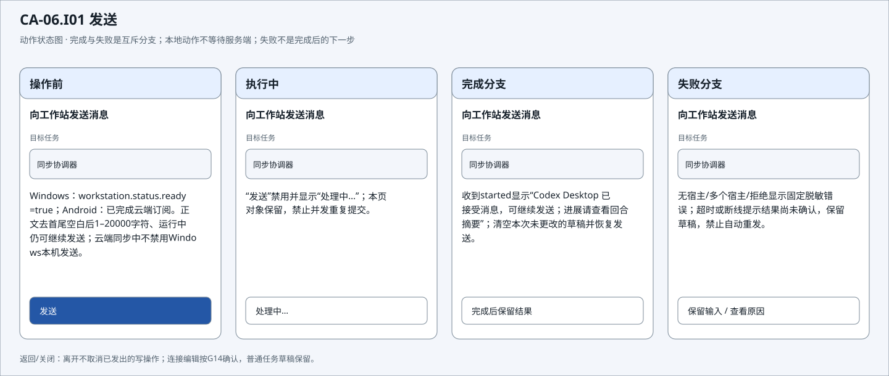

**CA-06.I02 — 清空草稿**

|条目|精确定义|
|---|---|
|触发与前置|草稿非空；出现G03放弃确认。|
|执行类别|local（按G13解释）|
|事件/调用|`local.clearDraft`|
|处理中|只等待用户确认。|
|成功|确认后清空未发送正文；无远端请求。|
|失败/重试|不产生网络错误；目标对象在本地已移除则提示“内容已不可用”并保留当前页面。前置条件不满足时禁用并说明原因。|
|返回/取消|返回触发页面，恢复原焦点/滚动；未保存输入按G03确认；在途操作不被伪装取消。|
|验收|Given 本页前置条件满足；When 点击“清空草稿”；Then 本地状态立即符合成功规则。断网重复执行仍可用；返回恢复焦点，不产生远端写请求。切换类连续点击按当前值逐次切换。|

### 页面验收

本页每个字段、每个动作和全部失败分支都有对应UI；320宽和200%字号可滚动到所有控件。不得用空值模拟成功。绑定见本页来源文件；实现检查本页所有事件ID。

## CA-07 · 回复流与未确认送达

**入口与返回**：CA-06成功接受或发送超时；返回CA-04。

**角色/设备**：已登录用户；Windows, Android。

**导航归属**：电脑端：任务；Android：任务。返回沿本页规定入口恢复；从系统通知进入时无应用内历史则返回相应导航首页。 Android二级页不展示一级导航；按来源返回任务列表或设置首页。

**布局**：聊天模板：顶部会话标题与最多2条上下文信息；用户消息右对齐、助手回答左对齐；消息内容最大800宽，手机铺满减32；正文独立滚动，80高输入面板固定在操作栏上方；其余字段在消息关联详情中展开。空态不生成假历史消息。

**数据绑定**：`apps/server/src/app.ts`。ResultMessage及TaskSnapshot；requestId+threadId关联。

|控件（从上到下）|类型|图中示例|校验/显示合同|
|---|---|---|---|
|消息回执|record|已接受 · 等待工作站结果|仅started可置已接受|
|回复|message|已检查两种重连场景，正在汇总。|从按需回合摘要读取真实文本和回合状态；发送回执不提供回复流。|
|结果状态|record|处理中|超时不转failed；显示结果尚未确认|

**页面规则**：实现差额：路由必须在终态后才删除pending；item.completed不能结束turn。每thread只有一条在途发送；未确认时先读详情再由用户显式发送新消息，不提供自动重放。

**空态/加载/错误**：首次读取显示“正在加载回复流与未确认送达”；成功无记录显示“暂无回复流与未确认送达记录”并保留入口操作。失败就地显示错误区；旧数据标“上次同步”；离线远端写操作禁用；本地查看、返回、复制、外观保存和已明确允许的配置保存仍可用。

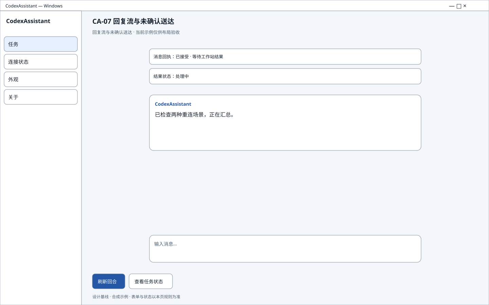

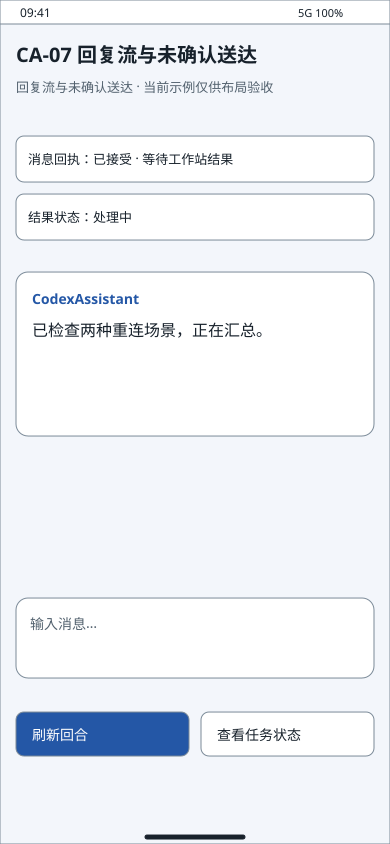

### 交互合同与状态图

**CA-07.I01 — 刷新回合**

|条目|精确定义|
|---|---|
|触发与前置|用户点击“刷新回合”；字段校验通过、在线、权限允许且此动作无在途请求。|
|执行类别|read（按G13解释）|
|事件/调用|`requestDetail(threadId)`|
|处理中|“刷新回合”禁用并显示“处理中…”；本页对象保留，禁止并发重复提交。|
|成功|读取最近回合后显示已知结果；不会再次执行发送。|
|失败/重试|读取失败保留已加载内容并标“上次同步”，首次无缓存显示错误面板；按G07显示对应错误原因，手动重试相同查询，不要求核实写入结果。|
|返回/取消|返回触发页面，恢复原焦点/滚动；未保存输入按G03确认；在途操作不被伪装取消。|
|验收|Given 操作前示例数据；When 触发“刷新回合”；Then 只有真实回执后呈现上述结果。另模拟失败、双击、离开页面，核对G02/G03。|

**CA-07.I02 — 查看任务状态**

|条目|精确定义|
|---|---|
|触发与前置|任务存在；无需联网。|
|执行类别|local（按G13解释）|
|事件/调用|`local.navigateTask`|
|处理中|本地导航。|
|成功|回CA-04继续查看快照。|
|失败/重试|不产生网络错误；目标对象在本地已移除则提示“内容已不可用”并保留当前页面。前置条件不满足时禁用并说明原因。|
|返回/取消|返回触发页面，恢复原焦点/滚动；未保存输入按G03确认；在途操作不被伪装取消。|
|验收|Given 本页前置条件满足；When 点击“查看任务状态”；Then 本地状态立即符合成功规则。断网重复执行仍可用；返回恢复焦点，不产生远端写请求。切换类连续点击按当前值逐次切换。|

### 页面验收

本页每个字段、每个动作和全部失败分支都有对应UI；320宽和200%字号可滚动到所有控件。不得用空值模拟成功。绑定见本页来源文件；实现检查本页所有事件ID。

## CA-08 · Windows托盘与窗口

**入口与返回**：系统托盘右键；双击图标恢复唯一窗口。

**角色/设备**：已登录用户；Windows。

**导航归属**：电脑端：任务；Android：任务。返回沿本页规定入口恢复；从系统通知进入时无应用内历史则返回相应导航首页。

**布局**：使用§3设备壳。字段按表从上到下；主体单独滚动，操作区固定在主体底部；主次操作为交互表前两项，其余为右上“更多操作”。

**数据绑定**：`apps/desktop/src/main.ts`。Tray/Menu/showWindow/app.quit。

|控件（从上到下）|类型|图中示例|校验/显示合同|
|---|---|---|---|
|应用|record|CodexAssistant|16/20/24/32px托盘图标；tooltip最多一行|
|菜单项|record|打开应用 / 连接状态 / 退出|此顺序；退出与其余项之间分隔线|

**页面规则**：使用Windows原生标题栏，不使用Mac三色圆点。只有菜单退出终止进程；按一次×不重复弹“是否退出”。

**空态/加载/错误**：首次读取显示“正在加载Windows托盘与窗口”；成功无记录显示“暂无Windows托盘与窗口记录”并保留入口操作。失败就地显示错误区；旧数据标“上次同步”；离线远端写操作禁用；本地查看、返回、复制、外观保存和已明确允许的配置保存仍可用。

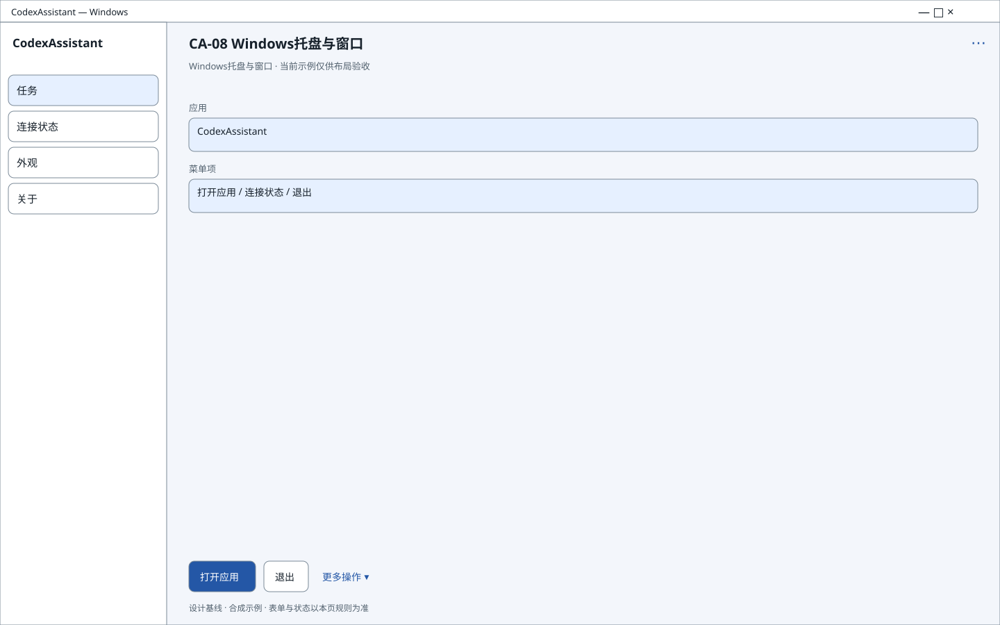

### 交互合同与状态图

**CA-08.I01 — 打开应用**

|条目|精确定义|
|---|---|
|触发与前置|点击菜单或双击托盘；无需网络。|
|执行类别|system（按G13解释）|
|事件/调用|`showWindow`|
|处理中|本地窗口恢复。|
|成功|创建或恢复唯一窗口，置前并聚焦；不新建第二套采集器。|
|失败/重试|系统调用失败时保留当前界面并显示系统返回原因；允许手动重试。没有系统回调时只能显示“已发起”，不能推断目标动作完成。退出账户的本地清理不等待网络回执。|
|返回/取消|返回触发页面，恢复原焦点/滚动；未保存输入按G03确认；在途操作不被伪装取消。|
|验收|离线触发“打开应用”，按系统回调和成功规则核对结果；拒绝系统权限或对象消失时显示真实错误，不显示服务端成功。|

**CA-08.I02 — 退出**

|条目|精确定义|
|---|---|
|触发与前置|菜单退出；确认按钮明确“退出应用”。|
|执行类别|system（按G13解释）|
|事件/调用|`app.quit`|
|处理中|正在停止采集；不删除缓存队列。|
|成功|显示“退出将停止本机同步，保留待上传记录”；确认后停止采集并退出。|
|失败/重试|系统调用失败时保留当前界面并显示系统返回原因；允许手动重试。没有系统回调时只能显示“已发起”，不能推断目标动作完成。退出账户的本地清理不等待网络回执。|
|返回/取消|返回触发页面，恢复原焦点/滚动；未保存输入按G03确认；在途操作不被伪装取消。|
|验收|离线触发“退出”，按系统回调和成功规则核对结果；拒绝系统权限或对象消失时显示真实错误，不显示服务端成功。|

**CA-08.I03 — 关闭窗口**

|条目|精确定义|
|---|---|
|触发与前置|标题栏×或Alt+F4。|
|执行类别|system（按G13解释）|
|事件/调用|`BrowserWindow.close`|
|处理中|本地关闭窗口。|
|成功|关闭当前窗但保留托盘和采集；再次打开恢复列表。|
|失败/重试|系统调用失败时保留当前界面并显示系统返回原因；允许手动重试。没有系统回调时只能显示“已发起”，不能推断目标动作完成。退出账户的本地清理不等待网络回执。|
|返回/取消|返回触发页面，恢复原焦点/滚动；未保存输入按G03确认；在途操作不被伪装取消。|
|验收|离线触发“关闭窗口”，按系统回调和成功规则核对结果；拒绝系统权限或对象消失时显示真实错误，不显示服务端成功。|

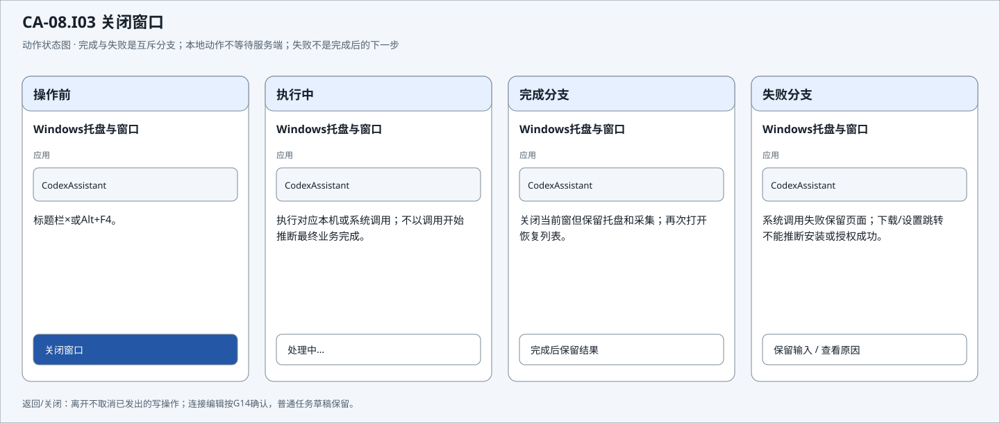

### 页面验收

本页每个字段、每个动作和全部失败分支都有对应UI；320宽和200%字号可滚动到所有控件。不得用空值模拟成功。绑定见本页来源文件；实现检查本页所有事件ID。

## CA-09 · 设置与外观

**入口与返回**：底部设置或侧栏设置；返回当前任务。

**角色/设备**：已登录用户；Windows, Android。

**导航归属**：电脑端：外观；Android：设置。返回沿本页规定入口恢复；从系统通知进入时无应用内历史则返回相应导航首页。 Android二级页不展示一级导航；按来源返回任务列表或设置首页。

**布局**：使用§3设备壳。字段按表从上到下；主体单独滚动，操作区固定在主体底部；主次操作为交互表前两项，其余为右上“更多操作”。

**数据绑定**：`android/app/src/main/java/site/codexassistant/SettingsPage.kt`。UI本地配置 + 应用既有更新入口。

|控件（从上到下）|类型|图中示例|校验/显示合同|
|---|---|---|---|
|连接|record|https://monitor.example.test|点击进入CA-02|
|主题|select|跟随系统|system/light/dark；只保存在本设备|
|动态色|select|关闭|仅Android12+显示；开启也保留状态色|
|当前版本|record|示例 2.0.x|取构建版本而非文档常量|

**页面规则**：不开放轮询间隔/outbox上限编辑；通知设置进入CA-10。没有“清理诊断数据即可清空上传队列”的误导按钮。

**空态/加载/错误**：首次读取显示“正在加载设置与外观”；成功无记录显示“暂无设置与外观记录”并保留入口操作。失败就地显示错误区；旧数据标“上次同步”；离线远端写操作禁用；本地查看、返回、复制、外观保存和已明确允许的配置保存仍可用。

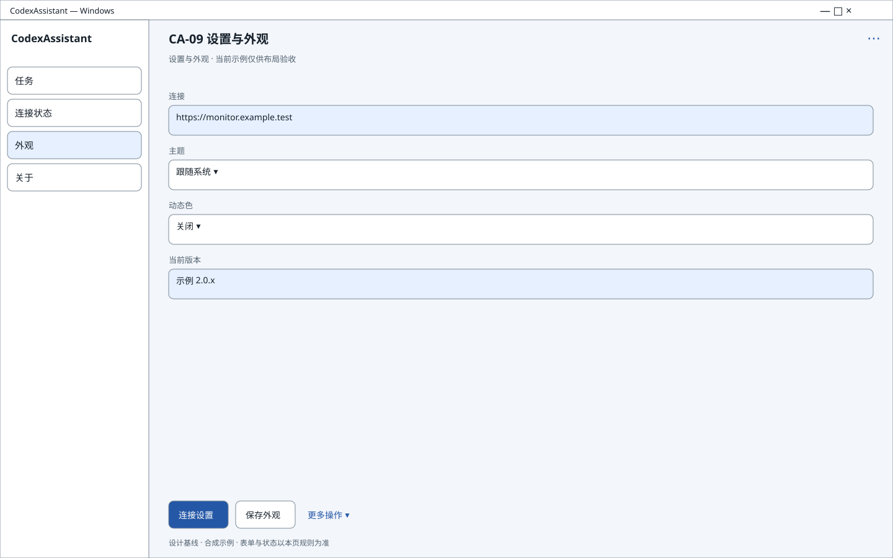

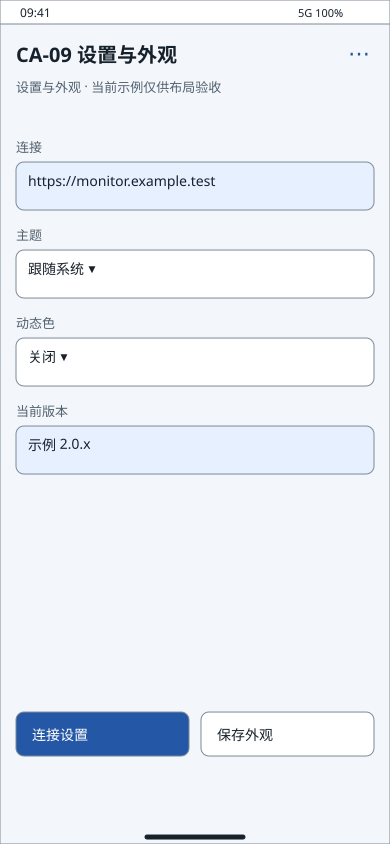

### 交互合同与状态图

**CA-09.I01 — 连接设置**

|条目|精确定义|
|---|---|
|触发与前置|有或无连接皆可。|
|执行类别|local（按G13解释）|
|事件/调用|`local.open(CA-02)`|
|处理中|本地导航。|
|成功|进入CA-02，旧Token不回显。|
|失败/重试|不产生网络错误；目标对象在本地已移除则提示“内容已不可用”并保留当前页面。前置条件不满足时禁用并说明原因。|
|返回/取消|返回触发页面，恢复原焦点/滚动；未保存输入按G03确认；在途操作不被伪装取消。|
|验收|Given 本页前置条件满足；When 点击“连接设置”；Then 本地状态立即符合成功规则。断网重复执行仍可用；返回恢复焦点，不产生远端写请求。切换类连续点击按当前值逐次切换。|

**CA-09.I02 — 保存外观**

|条目|精确定义|
|---|---|
|触发与前置|主题值在枚举内；无需联网。|
|执行类别|system（按G13解释）|
|事件/调用|`local.preferences`|
|处理中|等待本机偏好存储回调；不需要联网。|
|成功|即时生效并在本设备重启后保留；不改变服务端。|
|失败/重试|保存失败保留原偏好和当前输入，显示“外观设置未保存”，允许手动重试。|
|返回/取消|返回触发页面，恢复原焦点/滚动；未保存输入按G03确认；在途操作不被伪装取消。|
|验收|离线保存后重新打开设置，值保持；模拟本地存储失败，界面不显示已保存。|

**CA-09.I03 — 检查更新**

|条目|精确定义|
|---|---|
|触发与前置|用户点击“检查更新”；字段校验通过、在线、权限允许且此动作无在途请求。|
|执行类别|read（按G13解释）|
|事件/调用|`update.check`|
|处理中|“检查更新”禁用并显示“处理中…”；本页对象保留，禁止并发重复提交。|
|成功|进入CA-11，展示平台特定更新结果。|
|失败/重试|读取失败保留已加载内容并标“上次同步”，首次无缓存显示错误面板；按G07显示对应错误原因，手动重试相同查询，不要求核实写入结果。|
|返回/取消|返回触发页面，恢复原焦点/滚动；未保存输入按G03确认；在途操作不被伪装取消。|
|验收|Given 操作前示例数据；When 触发“检查更新”；Then 只有真实回执后呈现上述结果。另模拟失败、双击、离开页面，核对G02/G03。|

### 页面验收

本页每个字段、每个动作和全部失败分支都有对应UI；320宽和200%字号可滚动到所有控件。不得用空值模拟成功。绑定见本页来源文件；实现检查本页所有事件ID。

## CA-10 · Android通知与权限

**入口与返回**：设置→通知；系统通知也可到达任务。

**角色/设备**：已登录用户；Android。

**导航归属**：电脑端：通知；Android：设置。返回沿本页规定入口恢复；从系统通知进入时无应用内历史则返回相应导航首页。 Android二级页不展示一级导航；按来源返回任务列表或设置首页。

**布局**：使用§3设备壳。字段按表从上到下；主体单独滚动，操作区固定在主体底部；主次操作为交互表前两项，其余为右上“更多操作”。

**数据绑定**：`android/app/src/main/java/site/codexassistant/CodexScreen.kt`。Android NotificationManager + 前台同步服务。

|控件（从上到下）|类型|图中示例|校验/显示合同|
|---|---|---|---|
|通知权限|record|未允许|按系统实际权限读取|
|同步服务|record|运行中|低重要性常驻通知，不伪造推送服务|
|任务变化通知|record|已开启|只控制渠道，不停止WebSocket连接|

**页面规则**：锁屏不显示完整回复；常驻通知点击进入连接状态。拒绝权限只影响可见提醒，不能标成Token失败。

**空态/加载/错误**：首次读取显示“正在加载Android通知与权限”；成功无记录显示“暂无Android通知与权限记录”并保留入口操作。失败就地显示错误区；旧数据标“上次同步”；离线远端写操作禁用；本地查看、返回、复制、外观保存和已明确允许的配置保存仍可用。

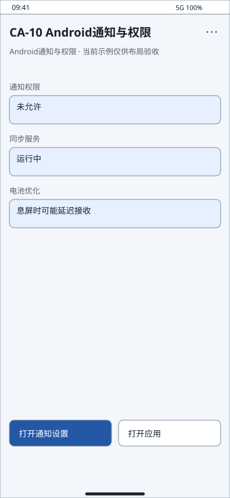

### 交互合同与状态图

**CA-10.I01 — 打开通知设置**

|条目|精确定义|
|---|---|
|触发与前置|Android通知能力可用；不要求在线。|
|执行类别|system（按G13解释）|
|事件/调用|`Android系统应用通知设置Intent`|
|处理中|“打开通知设置”禁用并显示“处理中…”；本页对象保留，禁止并发重复提交。|
|成功|由系统页面修改权限；回前台重新读取权限，不假定用户授权。|
|失败/重试|系统调用失败时保留当前界面并显示系统返回原因；允许手动重试。没有系统回调时只能显示“已发起”，不能推断目标动作完成。退出账户的本地清理不等待网络回执。|
|返回/取消|返回触发页面，恢复原焦点/滚动；未保存输入按G03确认；在途操作不被伪装取消。|
|验收|离线触发“打开通知设置”，按系统回调和成功规则核对结果；拒绝系统权限或对象消失时显示真实错误，不显示服务端成功。|

**CA-10.I02 — 打开任务**

|条目|精确定义|
|---|---|
|触发与前置|用户点击任务通知；通知只有脱敏标题+状态。|
|执行类别|system（按G13解释）|
|事件/调用|`notification.taskId→CA-04`|
|处理中|“打开任务”禁用并显示“处理中…”；本页对象保留，禁止并发重复提交。|
|成功|有效taskId打开该任务；资源不存在显示“任务已不在快照中”并返回列表。|
|失败/重试|系统调用失败时保留当前界面并显示系统返回原因；允许手动重试。没有系统回调时只能显示“已发起”，不能推断目标动作完成。退出账户的本地清理不等待网络回执。|
|返回/取消|返回触发页面，恢复原焦点/滚动；未保存输入按G03确认；在途操作不被伪装取消。|
|验收|离线触发“打开任务”，按系统回调和成功规则核对结果；拒绝系统权限或对象消失时显示真实错误，不显示服务端成功。|

### 页面验收

本页每个字段、每个动作和全部失败分支都有对应UI；320宽和200%字号可滚动到所有控件。不得用空值模拟成功。绑定见本页来源文件；实现检查本页所有事件ID。

## CA-11 · 版本检查与下载

**入口与返回**：设置→检查更新；返回设置。

**角色/设备**：已登录用户；Windows, Android。

**导航归属**：电脑端：关于；Android：设置。返回沿本页规定入口恢复；从系统通知进入时无应用内历史则返回相应导航首页。 Android二级页不展示一级导航；按来源返回任务列表或设置首页。

**布局**：使用§3设备壳。字段按表从上到下；主体单独滚动，操作区固定在主体底部；主次操作为交互表前两项，其余为右上“更多操作”。

**数据绑定**：`apps/desktop/src/main.ts`。update.check/update.download；Android对应Update入口。

|控件（从上到下）|类型|图中示例|校验/显示合同|
|---|---|---|---|
|当前版本|record|2.0.x（示例）|运行时构建值|
|发布版本|record|2.1.x（示例）|Windows语义版本，Android versionCode；未知不显示已最新|
|更新内容|record|稳定性与界面改进|来源清单字段缺失显示未提供，不生成文案|

**页面规则**：目标版本检查必须拒绝降级；没有可信大小/哈希则不展示“验证通过”。安装由系统完成，返回应用读取实际版本。

**空态/加载/错误**：首次读取显示“正在加载版本检查与下载”；成功无记录显示“暂无版本检查与下载记录”并保留入口操作。失败就地显示错误区；旧数据标“上次同步”；离线远端写操作禁用；本地查看、返回、复制、外观保存和已明确允许的配置保存仍可用。

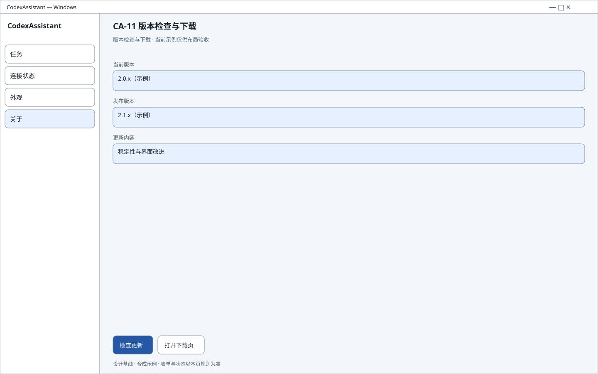

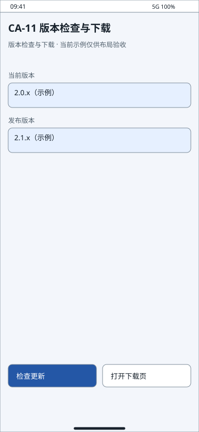

### 交互合同与状态图

**CA-11.I01 — 检查更新**

|条目|精确定义|
|---|---|
|触发与前置|用户点击“检查更新”；字段校验通过、在线、权限允许且此动作无在途请求。|
|执行类别|read（按G13解释）|
|事件/调用|`update.check`|
|处理中|“检查更新”禁用并显示“处理中…”；本页对象保留，禁止并发重复提交。|
|成功|只有成功读取清单才显示“已是最新版本”或“发现新版本”。|
|失败/重试|读取失败保留已加载内容并标“上次同步”，首次无缓存显示错误面板；按G07显示对应错误原因，手动重试相同查询，不要求核实写入结果。|
|返回/取消|返回触发页面，恢复原焦点/滚动；未保存输入按G03确认；在途操作不被伪装取消。|
|验收|Given 操作前示例数据；When 触发“检查更新”；Then 只有真实回执后呈现上述结果。另模拟失败、双击、离开页面，核对G02/G03。|

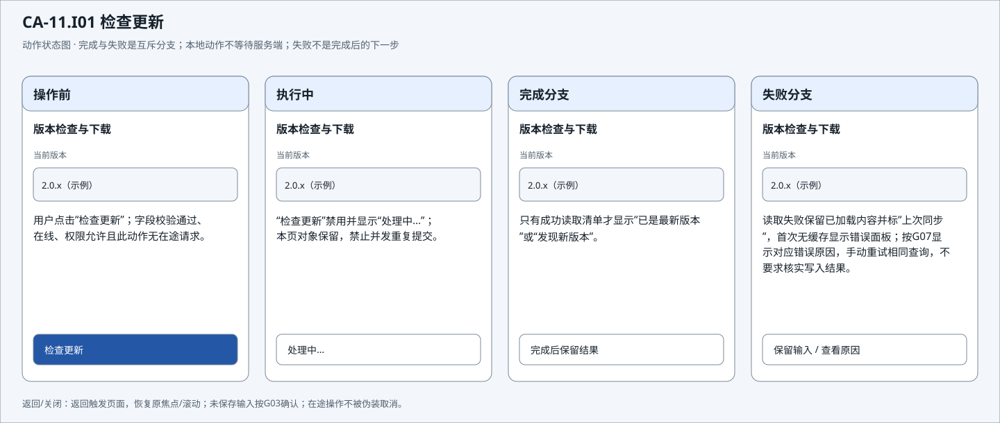

**CA-11.I02 — 打开下载页**

|条目|精确定义|
|---|---|
|触发与前置|用户点击“打开下载页”；字段校验通过、在线、权限允许且此动作无在途请求。|
|执行类别|system（按G13解释）|
|事件/调用|`update.download(platform)`|
|处理中|“打开下载页”禁用并显示“处理中…”；本页对象保留，禁止并发重复提交。|
|成功|系统浏览器打开经校验HTTPS链接；应用显示“已打开下载页”，不显示已安装。|
|失败/重试|按系统更新/下载/节点控制回调显示具体失败原因，保留可核实的当前阶段。只在前一阶段满足本页规则时允许下一动作；重试不跳过权限、文件完整性或签名检查。|
|返回/取消|返回触发页面，恢复原焦点/滚动；未保存输入按G03确认；在途操作不被伪装取消。|
|验收|核对本页系统调用及成功规则；模拟拒绝、取消、离线和重复点击，不能把已发起、下载完成或打开安装器当作安装成功。节点停止只改变本机节点。|

### 页面验收

本页每个字段、每个动作和全部失败分支都有对应UI；320宽和200%字号可滚动到所有控件。不得用空值模拟成功。绑定见本页来源文件；实现检查本页所有事件ID。

## CA-12 · 连接诊断与只读状态

**入口与返回**：任务详情诊断或设置连接状态；返回原页。

**角色/设备**：已登录用户；Windows, Android。

**导航归属**：电脑端：连接状态；Android：设置。返回沿本页规定入口恢复；从系统通知进入时无应用内历史则返回相应导航首页。 Android二级页不展示一级导航；按来源返回任务列表或设置首页。

**布局**：使用§3设备壳。字段按表从上到下；主体单独滚动，操作区固定在主体底部；主次操作为交互表前两项，其余为右上“更多操作”。

**数据绑定**：`apps/desktop/src/renderer/workspace.js`。MonitorStatus、TaskSnapshot.runtimeStatus、freshness及错误。 Android：SyncCoordinator.state / TaskRepository；恢复设计已实现。

|控件（从上到下）|类型|图中示例|校验/显示合同|
|---|---|---|---|
|传输|record|连接中|Windows与Android各自状态枚举；Android 恢复状态不可混同工作站不可达|
|采集证据|record|近期采集|freshness而非业务更新时间|
|运行时|record|active|诊断区展示原枚举|
|错误|record|无|code和脱敏message，无错误显示“无”|

**页面规则**：没有队列计数IPC时显示“待上传数量未提供”；不得显示0。outbox满是上传故障，不是任务失败，不提供破坏性清空按钮。离线不能一律称为网络故障。无默认网络显示等待网络；重连显示恢复进度与退避；认证/协议错误引导编辑配置。后台服务不可用与网络状态分别说明。

**空态/加载/错误**：首次读取显示“正在加载连接诊断与只读状态”；成功无记录显示“暂无连接诊断与只读状态记录”并保留入口操作。失败就地显示错误区；旧数据标“上次同步”；离线远端写操作禁用；本地查看、返回、复制、外观保存和已明确允许的配置保存仍可用。 恢复过程中保留上次同步；仅当前连接的 snapshot 恢复已连接与发送能力，不以回到前台或 onOpen 冒充成功。

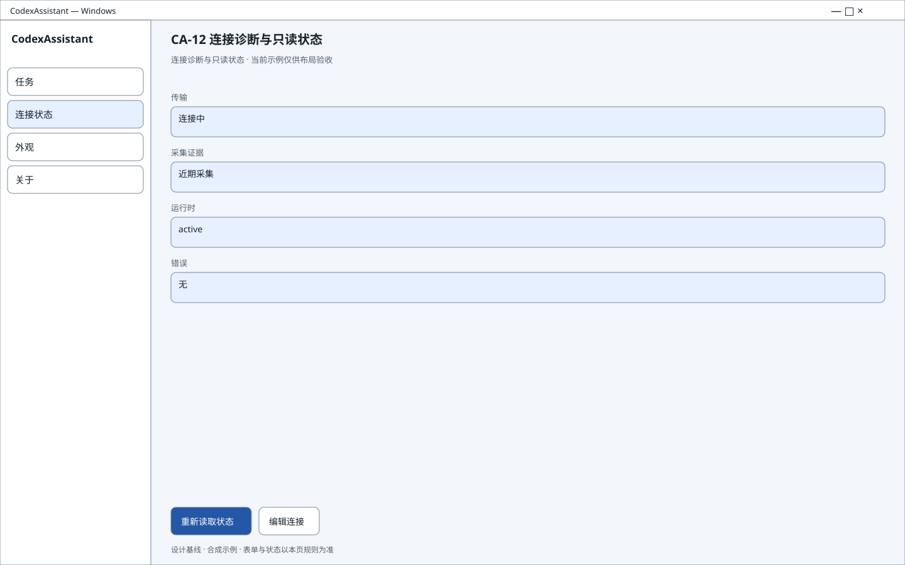

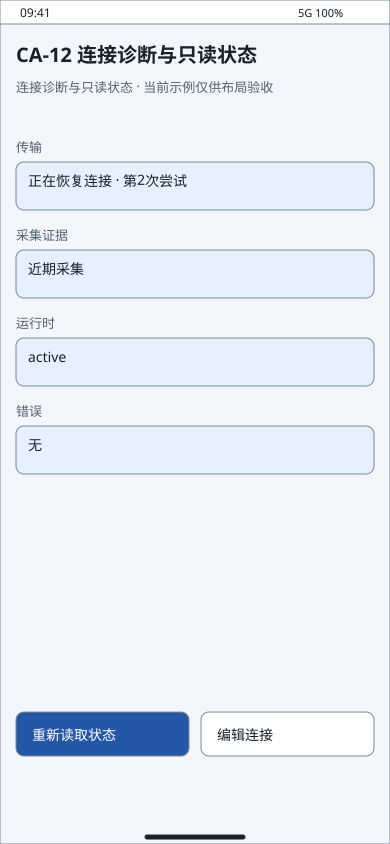

### 交互合同与状态图

**CA-12.I01 — 重新读取状态**

|条目|精确定义|
|---|---|
|触发与前置|桥接/同步对象可读；失联可本地读上次值。|
|执行类别|system（按G13解释）|
|事件/调用|`getSyncStatus / repository.state`|
|处理中|“重新读取状态”禁用并显示“处理中…”；本页对象保留，禁止并发重复提交。|
|成功|只刷新显示和快照，不重启Codex任务。|
|失败/重试|系统调用失败时保留当前界面并显示系统返回原因；允许手动重试。没有系统回调时只能显示“已发起”，不能推断目标动作完成。退出账户的本地清理不等待网络回执。|
|返回/取消|返回触发页面，恢复原焦点/滚动；未保存输入按G03确认；在途操作不被伪装取消。|
|验收|离线触发“重新读取状态”，按系统回调和成功规则核对结果；拒绝系统权限或对象消失时显示真实错误，不显示服务端成功。|

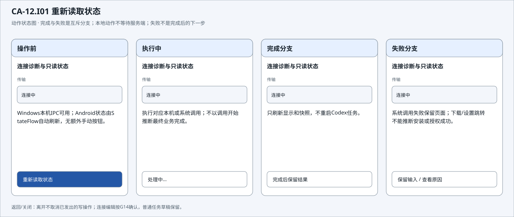

**CA-12.I02 — 编辑连接**

|条目|精确定义|
|---|---|
|触发与前置|无需联网。|
|执行类别|local（按G13解释）|
|事件/调用|`local.open(CA-02)`|
|处理中|本地导航。|
|成功|进入连接配置，保留旧错误用于返回诊断。|
|失败/重试|不产生网络错误；目标对象在本地已移除则提示“内容已不可用”并保留当前页面。前置条件不满足时禁用并说明原因。|
|返回/取消|返回触发页面，恢复原焦点/滚动；未保存输入按G03确认；在途操作不被伪装取消。|
|验收|Given 本页前置条件满足；When 点击“编辑连接”；Then 本地状态立即符合成功规则。断网重复执行仍可用；返回恢复焦点，不产生远端写请求。切换类连续点击按当前值逐次切换。|

### 页面验收

本页每个字段、每个动作和全部失败分支都有对应UI；320宽和200%字号可滚动到所有控件。不得用空值模拟成功。绑定见本页来源文件；实现检查本页所有事件ID。

## CA-13 · 平板列表与详情

**入口与返回**：Android视口≥840；选中任务展开右栏。

**角色/设备**：已登录用户；Tablet。

**导航归属**：电脑端：任务；Android：任务。返回沿本页规定入口恢复；从系统通知进入时无应用内历史则返回相应导航首页。

**布局**：使用§3设备壳。字段按表从上到下；主体单独滚动，操作区固定在主体底部；主次操作为交互表前两项，其余为右上“更多操作”。

**数据绑定**：`android/app/src/main/java/site/codexassistant/CodexScreen.kt`。同CA-03/CA-04数据与事件。

|控件（从上到下）|类型|图中示例|校验/显示合同|
|---|---|---|---|
|选中任务|record|同步协调器 · 进行中|taskId保持，不由位置索引选中|
|计划|record|2/5步骤完成|状态同任务详情|
|摘要|message|正在核对恢复结果|按需载入；切换时取消旧读请求|

**页面规则**：600–839只显示Rail+单内容，不能压出不可用双栏。旋转保留会话草稿/选中ID/滚动锚点；仅布局切换不发新写请求。

**空态/加载/错误**：首次读取显示“正在加载平板列表与详情”；成功无记录显示“暂无平板列表与详情记录”并保留入口操作。失败就地显示错误区；旧数据标“上次同步”；离线远端写操作禁用；本地查看、返回、复制、外观保存和已明确允许的配置保存仍可用。

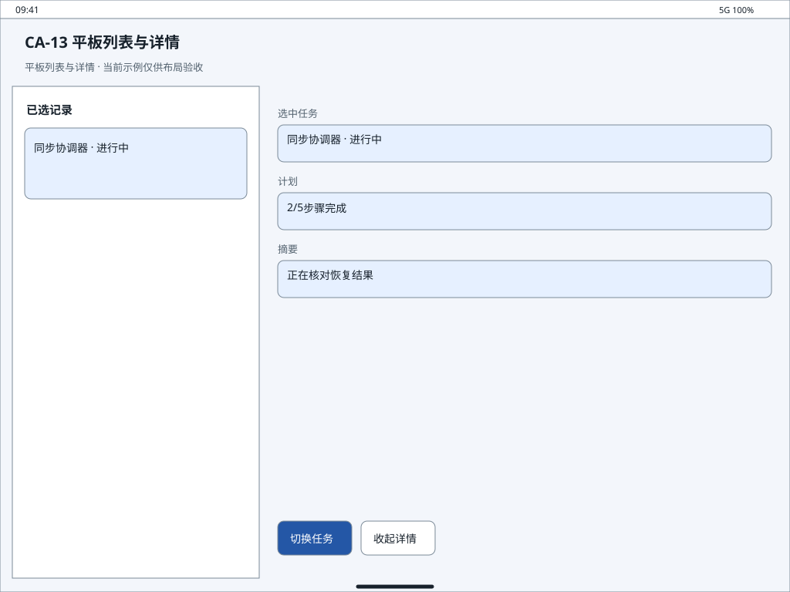

### 交互合同与状态图

**CA-13.I01 — 切换任务**

|条目|精确定义|
|---|---|
|触发与前置|点击左栏任务卡，无在途写操作冲突。|
|执行类别|local（按G13解释）|
|事件/调用|`local.selectTask`|
|处理中|本地状态即时更新，无网络请求、无等待服务端回执。|
|成功|右侧换成新taskId；只请求新任务摘要一次。|
|失败/重试|不产生网络错误；目标对象在本地已移除则提示“内容已不可用”并保留当前页面。前置条件不满足时禁用并说明原因。|
|返回/取消|返回触发页面，恢复原焦点/滚动；未保存输入按G03确认；在途操作不被伪装取消。|
|验收|Given 本页前置条件满足；When 点击“切换任务”；Then 本地状态立即符合成功规则。断网重复执行仍可用；返回恢复焦点，不产生远端写请求。切换类连续点击按当前值逐次切换。|

**CA-13.I02 — 收起详情**

|条目|精确定义|
|---|---|
|触发与前置|已选任务。|
|执行类别|local（按G13解释）|
|事件/调用|`local.clearSelection`|
|处理中|本地重排。|
|成功|返回列表状态；缩到<840把详情作为返回栈页面。|
|失败/重试|不产生网络错误；目标对象在本地已移除则提示“内容已不可用”并保留当前页面。前置条件不满足时禁用并说明原因。|
|返回/取消|返回触发页面，恢复原焦点/滚动；未保存输入按G03确认；在途操作不被伪装取消。|
|验收|Given 本页前置条件满足；When 点击“收起详情”；Then 本地状态立即符合成功规则。断网重复执行仍可用；返回恢复焦点，不产生远端写请求。切换类连续点击按当前值逐次切换。|

### 页面验收

本页每个字段、每个动作和全部失败分支都有对应UI；320宽和200%字号可滚动到所有控件。不得用空值模拟成功。绑定见本页来源文件；实现检查本页所有事件ID。

## 6. 平台与系统级行为

Windows：使用系统原生标题栏及右侧最小化/最大化/关闭按钮，支持Alt+F4关闭窗保留托盘、双击托盘恢复唯一窗口、右键托盘菜单、Alt+Space系统菜单、Win+方向键贴靠。任务栏显示应用独立图标，不使用Dock。托盘图标16/20/24/32px同一矢量轮廓；状态改变加非颜色独占的形状标识。

Android：最低API26；前台同步服务仅一条常驻低重要性通知；任务通知独立渠道。锁屏显示脱敏标题+状态，隐藏正文。未授权POST_NOTIFICATIONS时说明权限状态，但不谎称订阅失败。平板≥840使用列表/详情双栏；旋转保留taskId和草稿。

更新：两端打开系统浏览器下载发布清单指定URL，不能显示“已安装”或模拟下载进度。Windows使用 semver 比较并拒绝降级，无效版本直接报错；Android按versionCode。未知签名/缺失哈希如实标“未提供”，不自动伪造校验成功。

Android 网络恢复：前台恢复和默认网络变化通过同一个连接入口处理；仅收到当前连接快照才显示已连接。保留缓存与草稿，不自动重发未知结果的业务消息。无网络显示等待网络，服务停止、认证失败和协议错误分别说明。详见网络恢复设计。

## 7. 发布验收门槛

1. 页面注册表全部可通过规定入口到达，返回后定位不丢失；没有孤立按钮、无意义“继续”按钮、正文写JSON或未说明的占位框。
2. 每个事件ID核对前置/处理中/成功/失败/返回，交互重复提交只产生一次有效动作；普通消息允许连续发送。断网/超时不能显示成功或重放未知写请求。
3. 像素验收以SVG中的结构和几何表为基准：布局尺寸偏差≤2px/dp，字体使用指定系统栈；系统标题栏、字体栅格化、平台文件选择器由OS决定，不要求跨OS像素一致。
4. 覆盖Web 1440×900/1024×768/390×844/320×640；Android 390×844、600×960、840×900、1024×768，字体100%/200%，深浅色、键盘打开、长文本；Windows应用另测125%/150%缩放、任务栏四周停靠/自动隐藏、标题栏关闭与托盘退出。
5. 对比度：普通文字≥4.5:1，大标题和控件边界≥3:1；Tab/读屏/减少动态效果通过；账号隔离、403深链、离线只读、换账号迟到写入逐条验证。
6. 静态图稿验收不替代设备验收；已完成 Android 单元、lint、专用 API 36 模拟器20次前后台恢复、3次网络恢复和服务端主动关闭恢复。真机行为、网络延迟与后端差额仍须按本表持续验收。

## 8. 来源快照与复刻方法

所有相对源码路径相对于当前项目根目录。渲染命令：`python docs/frontend-design/render.py`。静态复核命令：`python docs/frontend-design/validate.py`（Python 3、playwright、Pillow，以及本机Microsoft Edge）。渲染只写当前项目的设计文档和 final 图稿；不会写产品源码或请求外部接口。源码 SHA-256 与 HEAD 记录在 source-baseline.json，包含本次审查时的工作区内容，不等同于只读已提交版本。

设计方法参考：[imagegen-frontend-mobile](https://github.com/diuzhev26-glitch/imagegen-frontend-mobile)。采用其平台原生、可读性、连续屏幕一致性要求；本交付为精确 SVG 线框/结构图，未调用外部绘图服务。
